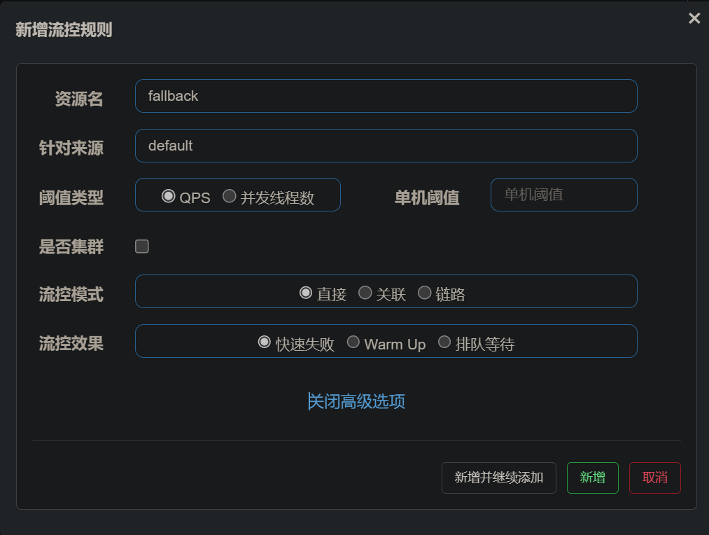
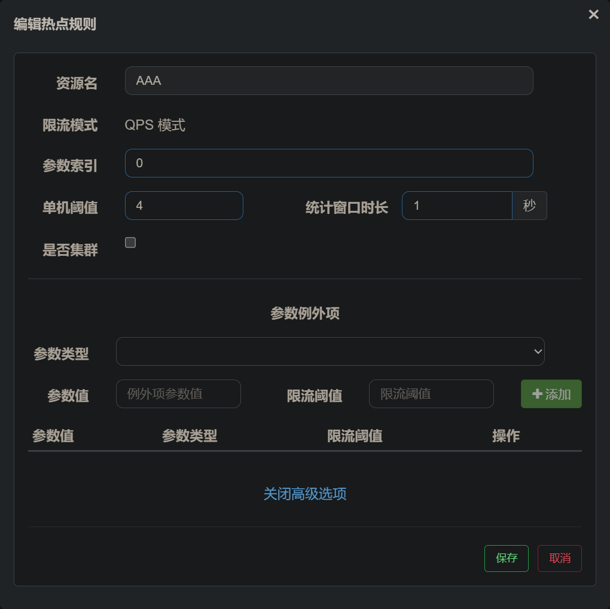
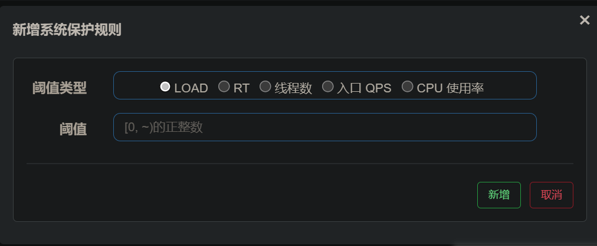
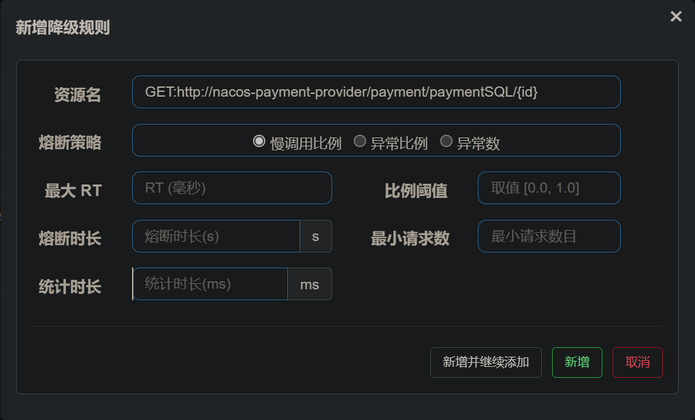

# Sentinel （流量控制组件）

**Sentinel以流量切入点，从流量控制   熔断降级   系统负载  等多个维度保护服务的稳定**

#### 服务端

1.  下载jar包&#x20;
2.  使用DOS窗口启动服务
3.  默认开放端口为8080
4.  登录的账号和密码都是`sentinel`

#### 核心库

1.  导入依赖
    ```xml
            <!-- nacos 的服务注册依赖 -->
            <dependency>
                <groupId>com.alibaba.cloud</groupId>
                <artifactId>spring-cloud-starter-alibaba-nacos-discovery</artifactId>
            </dependency>
            <!-- sentinel 依靠 nacos 做持久化的依赖 -->
            <dependency>
                <groupId>com.alibaba.csp</groupId>
                <artifactId>sentinel-datasource-nacos</artifactId>
            </dependency>
            <!-- sentinel 依赖 -->
            <dependency>
                <groupId>com.alibaba.cloud</groupId>
                <artifactId>spring-cloud-starter-alibaba-sentinel</artifactId>
            </dependency>
            <!-- sentinel 配置 opfeign 做服务降级的依赖 -->
            <dependency>
                <groupId>org.springframework.cloud</groupId>
                <artifactId>spring-cloud-starter-openfeign</artifactId>
            </dependency>
            <!-- 进行服务监控的 依赖 -->
            <dependency>
                <groupId>org.springframework.boot</groupId>
                <artifactId>spring-boot-starter-actuator</artifactId>
            </dependency>


    ```
2.  书写`application.yml`配置文件
    ```yaml
    server:
    # 端口
      port: 8401

    spring:
      application:
      # 服务名
        name: cloudalibaba-sentinel-service
      cloud:
        nacos:
        # 服务注册中心 
          discovery:
          # nacos服务端的地址
            server-addr: localhost:8848
        sentinel:
          transport:
          # 服务端的地址 默认端口为8080
            dashboard: localhost:8080
            port: 8719  #默认8719，应用与Sentinel控制台交互的端口，应用本地会起一个该端口占用HttpServer

    # 开放端口 配合 监控 获取更多信息
    management:
      endpoints:
        web:
          exposure:
          # * 为通配符 表示所有
            include: '*'
    ```

#### 限流功能



1.  阈值
    1.  QPS 每秒的处理的请求数量 在 `单机阈值`设置 请求超过阈值 则执行
    2.  并发线程数 当该接口的并发线程数 达到数量则执行
2.  流控模式
    1.  直接：使用上面配置规则进行限流
    2.  关联：可以关联另一个资源 如果另一个资源的流量达到阈值触发本服务的降级&#x20;
        1.  设置 A服务的限流 关联 B  当B服务达到阈值 限流 A&#x20;
    3.  链路  可以关联 本服务的一个入口服务 当本服务的流量达到阈值的时候 限流入口服务
        1.  设置 A 和 B 都需要调用 C 服务 设置C服务链路限流 入口服务为A 当C服务的流量达到阈值 则会限流 A服务
3.  限流策略
    1.  直接失败：当应用触发流控、降级或系统规则时，默认抛出`BlockException`异常类的子类（触发流控规则，则抛出流控异常`FlowException`；触发降级规则，则抛出降级异常`DegradeException`）。
        1.  `@SentinelResource(value = "AAA" , blockHandler = "blockHandler")` 注解 `value`则是资源名 `blockHandler`是限流的方法
        2.  `blockHandler` / `blockHandlerClass`：`blockHandler` 对应处理`BlockException`的函数名称，为可选项。blockHandler函数访问范围需要是`public`，返回类型需要与原方法相匹配，参数类型需要和原方法相匹配并且最后加一个额外的类型为`BlockException`的参数。blockHandler函数默认需要和原方法在同一个类中。若希望使用其它类的函数，则可以指定`blockHandlerClass`为对应的类的`Class`对象，对应的函数必需为static函数，否则无法解析。
    2.  Warm Up（预热）:即冷启动 / 预热的方式。当系统长期处于低水位的情况下，若流量突然增加，可能会把系统水位瞬间拉高把系统压垮。通过配置冷启动规则，可以让通过的流量缓慢增加，在一定时间内逐渐增加到阈值上限，给冷系统一个预热的时间，避免冷系统被压垮。
        1.  阈值除以coldFactor（默认值为3），经过预热时长后才会达到阈值 设置阈值 / 3 为初始阈值 在预热时间内达到 最大阈值
        2.  令牌桶算法实现
        3.  当流量突然增大的时候，我们常常会希望系统从空闲状态到繁忙状态的切换的时间长一些。即如果系统在此之前长期处于空闲的状态，我们希望处理请求的数量是缓步的增多，经过预期的时间以后，到达系统处理请求个数的最大值。Warm Up（冷启动，预热）模式就是为了实现这个目的的。
    3.  排队等待：设置等待时间 如果达到阈值 则等待 设置时间的时间 如果 超过时间还没有处理 则失败
        1.  这种策略会严格控制请求通过的间隔时间 也就是让请求以匀速通过&#x20;
        2.  实现的是漏桶算法
        3.  处理间隔性的突发流量  不在大量流量来的一秒 拒绝多余请求 而是在空闲时逐渐处理这些请求

#### 热点限流



1.  参数索引 ：服务接口的 形参索引
2.  单机阈值 ：限流阈值
3.  统计窗口时长 ：以这个时间为单位  统计请求次数 超过了就执行限流策略&#x20;
    1.  设置 单机阈值为 100  统计窗体 设置100秒 参数索引设置为0  意思  是这个服务在接收 0索引的参数的请求 100秒内不能超过100个超过的请求会被限流处理
4.  参数类型  为形参参数
5.  参数值为特定值&#x20;
6.  阈值为该值的阈值
    1.  可以给特定参数的特定值设定限流特定的规则&#x20;

#### 系统规则



Load自适应：

-   Load 自适应（仅对 Linux/Unix-like 机器生效）：系统的 load1 作为启发指标，进行自适应系统保护。当系统 load1 超过设定的启发值，且系统当前的并发线程数超过估算的系统容量时才会触发系统保护（BBR 阶段）。系统容量由系统的 `maxQps * minRt` 估算得出。设定参考值一般是 `CPU cores * 2.5`。

TR：当单台机器上所有入口流量的平均 RT 达到阈值即触发系统保护，单位是毫秒。

线程数：并发数量 当单台机器上所有入口流量的并发线程数达到阈值即触发系统保护。

QPS：当单台机器上所有入口流量的 QPS 达到阈值即触发系统保护。

CPU使用率：当单台机器上所有入口流量的 QPS 达到阈值即触发系统保护。

#### `@SentinelResource`注解

```java
    @SentinelResource(value = "AAA" , blockHandler = "blockHandler" , fallback = "fallBackHandler"
            ,exceptionsToIgnore = IllegalArgumentException.class)
```

1.  value 服务名必写
2.  `blockHandler`  限流和熔断之后 的降级方法
3.  `fallback` 发生异常了 的降级方法
4.  `exceptionsToIgnore ` 让`fallback ` 书写不捕获这个异常

#### 熔断



1.  资源名 ： 资源名 作用对象
2.  熔断策略
    1.  慢调用 响应处理使用慢触发
        1.  最大RT ：最大平均响应超过这个值则为 慢调用
        2.  比例阈值：超过这个阈值则熔断
        3.  熔断时间：熔断时间
        4.  最小请求数：慢请求最小数量 超过熔断
        5.  统计时长：在多少时间单位中统计 **所有默认为 1s且不可以更改**
            如果在统计时间内 请求达到最小请求数且响应时间超过RT的时间超过比例触发熔断
    2.  异常比例
        1.  比例阈值：异常的比例超过这个则触发
            在统计时间内 请求数达到最小数量请求 且异常比例高于阈值 熔断
    3.  异常个数
        1.  异常数 ：异常的次数超过这个则触发熔断
        2.  默认的采集时间 是1分钟 所以设置采集时间必须大于1分钟
            在统计时间内 请求数量达到最小请求数且异常数量超过设置异常数量触发熔断

#### sentinel规则持久化配置

| 推送模式  | 说明                                                                                                                                                                                                               | 优点                         | 缺点                                                               |
| --------- | ------------------------------------------------------------------------------------------------------------------------------------------------------------------------------------------------------------------ | ---------------------------- | ------------------------------------------------------------------ |
| 原始模式  | API 将规则推送至客户端并直接更新到内存中，扩展写数据源（WritableDataSource）                                                                                                                                       | 简单，无任何依赖             | 不保证一致性；规则保存在内存中，重启即消失。严重不建议用于生产环境 |
| Pull 模式 | 扩展写数据源（WritableDataSource）， 客户端主动向某个规则管理中心定期轮询拉取规则，这个规则中心可以是 RDBMS、文件 等                                                                                               | 简单，无任何依赖；规则持久化 | 不保证一致性；实时性不保证，拉取过于频繁也可能会有性能问题。       |
| Push 模式 | 扩展读数据源（ReadableDataSource），规则中心统一推送，客户端通过注册监听器的方式时刻监听变化，比如使用 `Nacos`、`Zookeeper `等配置中心。这种方式有更好的实时性和一致性保证。生产环境下一般采用 push 模式的数据源。 | 规则持久化；一致性；快速     | 引入第三方依赖                                                     |

#### PUSH模式

1.  引入依赖
    ```xml
            <dependency>
                <groupId>com.alibaba.csp</groupId>
                <artifactId>sentinel-datasource-nacos</artifactId>
            </dependency>
    ```
2.  修改配置文件
    ```yaml
    spring:
      cloud:
        sentinel:
          datasource:
            ds1:
              nacos:
              # nacos服务的地址
                server-addr: localhost:8848 
              # 配置中心设置的的服务名 id
                data-id: nacos-order-consumer
              # 配置中心的组 id
                group-id: DEFAULT_GROUP
              # json 格式  
                data-type: json
                rule-type: flow
    # 开放监听端口（不建议在生产环境使用 可以方便配置之后复制配置文件到nacos）
    management:
      endpoints:
        web:
          exposure:
            include: '*'

    ```
