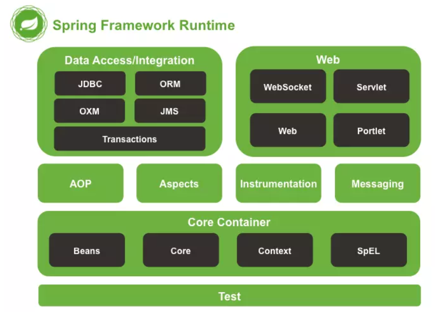

### Spring的作用和好处

- 简化企业级应用开发的复杂度
    - 大量使用IoC的设计模式减少模块与模块直接的依赖关系做到高内聚低耦合
    - 使用了AOP的的设计思想增强了代码的复用性加速了程序的开发效率
- 框架整合高效整合其他的框架
    - 他提供了一系列的框架的整合 可以快速使用其他框架进行开发

Spring 是一个**一站式** **轻量级** 的**非入侵**式框架

### Spring的架构总览

1. core spring的核心 包含对象管理、上下文管理以及EL表达式
2. AOP aspects 面向切面编程 以及思想实现
3. Data Access 数据库访问，包含一系列的数据框架的支持以及事务管理
4. web 对应页面交互 我们后期学习springMVC框架就包含在这个模块中
5. test 单元测试 整合了junit单元测试



### Spring的学习路线

1. 第一部分：核心容器 核心概念（IOC/DI）容器的基本操作
2. 第二部分： AOP 面向切面编程 概念、基础操作
3. 第三部分： 事务管理
4. 第四部分：整合其他框架，整合`mybatis`
5. 第五部分：`spring`家族成员：`springMVC springBoot springCloud`

### 程序之间的耦合和解耦合

**程序的耦合**

就是程序之间的关联度，也就是多个类或者多个模块之间的依赖程度(即一个类或模块大量需要应一个类或者模块的资源)

如果每个模块或者每个类都强制互相依赖那么我们后期代码的维护成本和扩展难度会很高

我们需要做的就是将模块和模块或者类和类之间的关系尽可能减小

做到高内聚低耦合。

**解耦合**

的方法很多

1、编译不依赖，运行后再依赖
比如我们jdbc使用的时候，通过反射进行驱动注册的：
`class.formname(“com.mysql.jdbc.Dirver”);`
好处：我们在类编译的时候是不需要com.mysql.jdbc.Dirver类，编译的时候可以不去家族驱动，
在项目运行的时候开始加载，在编译的过程中不需要建立依赖关系。
坏处：我们如果在反射调用类的时候，字符串拼写错误，容易发生调用失败等问题。
可以通过配置文件配合反射解决问题。
2、通过工厂模式进行解耦
在实际开发中我们可以将三层对象都交给工厂生产，当项目启动的时候所有的类都由工厂来创建，类
和类之间管理就没有太多依赖，如果我们需要使用其他的类，可以在工厂中获取。使用者之间耦合度就
会降低。

等….

## Spring IoC机制

### 什么是IoC机制

IOC Inverse Of Control：控制反转

**控制**：对于对象的控制权限，一般是掌握在程序员手中的通过new对象直接进行对象的创建

**反转：**将控制权限反转，不在由程序员负责对象创建将权限给到Spring容器我们只需要在需要的时候使用就可以

**Spring的控制反转是使用`DI(依赖注入的方式)`实现的** 

### IoC的好处

控制反转可以很好的解决类与类之间的强依赖关系使用

接口互相联系只需要配置对于的信息需要在扩展的时候不修改内部代码 符合**内开外闭**的设计原则 

更灵活的设计项目结构

## Spring的入门案例

```xml
导入maven依赖坐标
<dependency>
      <groupId>org.springframework</groupId>
      <artifactId>spring-context</artifactId>
      <version>5.3.19</version>
</dependency>
```

配置Spring核心配置文件

<bean>标签配置Spring容器要管理的对象

尽量使用`applicationContext.xml` 作为文件的文件名

```xml
<?xml version="1.0" encoding="UTF-8"?>
<beans xmlns:xsi="http://www.w3.org/2001/XMLSchema-instance"
       xmlns="http://www.springframework.org/schema/beans"
       xmlns:context="http://www.springframework.org/schema/context"
       xmlns:aop="http://www.springframework.org/schema/aop"
       xsi:schemaLocation="http://www.springframework.org/schema/beans http://www.springframework.org/schema/beans/spring-beans-4.1.xsd
       http://www.springframework.org/schema/context
       http://www.springframework.org/schema/context/spring-context-4.1.xsd
       http://www.springframework.org/schema/aop
       http://www.springframework.org/schema/aop/spring-aop-4.1.xsd">
	<bean id="user" class="com.java.pojo.User">
		<property name="id" value="1"/>
		<property name="userName" value="Ava"/>
  	</bean>
```

测试对象

```java
public class MyTest {
    public static void main(String[] args) {
				//获取Spring工厂对象
        ApplicationContext context
                = new ClassPathXmlApplicationContext("applicationContext.xml");
				//获取配置文件中的bean 使用id获取 做一些强转
        Temp temp = (Temp) context.getBean("temp");
        System.out.println(temp);
    }
}
```

## SpringIoC容器

我们在获取spring容器中的对象的时候一般使用的是`ClassPathXmlApplicationContext`

```java
ApplicationContext context =
                new ClassPathXmlApplicationContext("applicationContext.xml");
```

**它的关系图**

其中`BeanFactory`是一个IoC容器的早期版本

功能较少基本只能进行对象的创建和管理 `BeanFactory`而且不是在一加载就创建而是在使用或者对象的时候才进行对象的创建

`ClassPathXmlApplicationContext` 是在一开始就加载xml配置中对象的实例(除了设置了懒加载 即延迟加载)


`ClassPathXmlApplicationContext` 相比于

`BeanFactory` 多了更多功能

- 实时刷新
- 自动装配
- 国际化支持
- 事件发布和支持

### `MyBeanFactory`

```java
package com.java.utils;

import org.dom4j.Document;
import org.dom4j.DocumentException;
import org.dom4j.Element;
import org.dom4j.io.SAXReader;

import java.util.HashMap;
import java.util.List;
import java.util.Map;

/**
 * @author lunch
 */
public class MyBeanFactory {
    private String filePath; //配置文件路径
    private final Map<String,Object> beans = new HashMap<>();  //对象管理容器
    public MyBeanFactory(String filePath){
        setFilePath(filePath);
    }

    /**
     * 设置对象管理容器值
     * 读取配置文件信息存入
     */
    private void setBeans(){
        //清空
        closeBeans();
        SAXReader saxReader = new SAXReader();
        try {
            Document read = saxReader.read(filePath);
            Element rootElement = read.getRootElement();
            List<Element> elements = rootElement.elements();
            if( !elements.isEmpty() ){
                for (Element element : elements) {
                    String id = element.attributeValue("id");
                    String clazz = element.attributeValue("class");
                    Object bean = Class.forName(clazz).newInstance();
                    beans.put(id,bean);
                }
            }
        } catch (DocumentException e) {
            e.printStackTrace();
        } catch (ClassNotFoundException | IllegalAccessException | InstantiationException e) {
            throw new RuntimeException(e);
        }
    }

    /**
     * 设置配置文件路径 
     * @param filePath 路径
     */
    public void setFilePath(String filePath) {
        this.filePath = filePath;
        setBeans();
    }

    /**
     * 
     * @param id 对象id
     * @return 容器中获取的对象
     * @throws ClassNotFoundException 没有在路径中找到
     */
    public Object getBean(String id) throws ClassNotFoundException {
        if(beans.containsKey(id)){
            return beans.get(id);
        }
        throw new ClassNotFoundException();
    }

    /**
     * 清理容器
     */
    private void closeBeans(){
        beans.clear();
    }
}
```

### Bean的实例化方式

1. 构造器创建对象
    
    ```xml
    <bean id="user" class="com.java.entity.User"/>
    ```
    
2. 实例工厂创建对象
    
    ```java
    public class UserFactory {
        public User openUser(){
            return new User();
        }
    }
    ```
    
    ```xml
    <bean id="factoryUser" class="com.java.entity.factory.UserFactory"/>
    <bean id="user1" factory-bean="factoryUser" factory-method="openUser"/>
    ```
    
    ```java
    ApplicationContext context =
                    new ClassPathXmlApplicationContext("applicationContext.xml");
            User bean = context.getBean("user1", User.class);
            System.out.println(bean);
    ```
    
3. 静态工厂对象
    
    ```java
    public static User createUser(){
            return new User();
    }
    ```
    
    ```xml
    <bean id="user2" class="com.java.entity.factory.UserFactory" factory-method="createUser"/>
    ```
    
    ```java
    ApplicationContext context =
                    new ClassPathXmlApplicationContext("applicationContext.xml");
            User user2 = context.getBean("user2",User.class);
            System.out.println(user2);
    ```
    

## springIOC管理bean的作用域

1. **什么是bean的作用域？**
当spring框架创建对象后，该对象使用（存活）范围就是对象的作用域，在`bean`标签中可以通过`scope`
属性来进行配置。可以设置的值：
    
    
    | 属性值         | 作用范围                                                         |
    | -------------- | ---------------------------------------------------------------- |
    | singleton      | 单例（默认），在spring容器中，无论获取多少次该对象，都是一个对象 |
    | prototype      | 多例                                                             |
    | request        | web项目使用，spring创建一个对象就会将对象存放到request域         |
    | session        | web项目使用，spring创建一个对象就会将对象存放到session域         |
    | global session | web项目使用，spring创建一个对象就会将对象存放到session共享域     |
2. **bean的初始化和销毁的方法**
    
    可以书写对象初始化的方法和销毁的方法交给Spring容器管理调用
    
    ```xml
    <bean id="person1" class="com.java.entity.Person" init-method="init" destroy-method="destroy"/>
    ```
    
    ```java
    package com.java.entity;
    
    /**
     * @author lunch
     */
    public class Person {
        private Integer id;
        public Person(){
            System.out.println("调用了空参构造");
        }
    
        public void init(){
            System.out.println("对象正在初始化....");
        }
        public void destroy(){
            System.out.println("对象正在销毁");
        }
    }
    ```
    

## DI依赖注入

依赖注入有两种方式

1. 使用构造方法进行注入
    
    ```xml
    <!--
    	按照构造器参数的顺序书写
    		ref 引用其他的被spring容器管理的对象
    		index 参数索引 从0开始
    		name  形参的标识符
    		type 按照类型进行注入
    	-->
    	<bean id="user3" class="com.java.entity.User">
    		<constructor-arg value="1" />
    		<constructor-arg ref="person"/>
    	</bean>
    ```
    
2. 使用对应的setter方法进行注入
    
    ```xml
    <!--
    		使用property标签
    			name 属性标识符
    			value 直接复制
    			ref 引用
    	-->
    	<bean id="user4" class="com.java.entity.User">
    		<property name="id" value="1"/>
    		<property name="person" ref="person"/>
    	</bean>
    ```
    
3. 针对一些自定义引用数据类型的注入
    1. 当容器中存在时可以直接使用`ref`属性进行引用
    2. 当容器不存在是可以直接在标签中书写`bean`标签进行构建
    
    ```xml
    <bean id="user4" class="com.java.entity.User">
    		<property name="id" value="1"/>
    		<property name="person">
    			<bean class="com.java.entity.Person'" />
    		</property>
    	</bean>
    ```
    

单例

```xml
<bean class="com.java.entity.Person" id="person"/>
```

```java
ClassPathXmlApplicationContext context =
                new ClassPathXmlApplicationContext("applicationContext.xml");
        Person person = context.getBean("person", Person.class);
        Person person1 = context.getBean("person", Person.class);
        Person person2 = context.getBean("person", Person.class);
        System.out.println(person1);
        System.out.println(person);
        System.out.println(person2);
```


多例

```xml
<bean class="com.java.entity.Person" id="person" scope="prototype"/>
```

```java
ClassPathXmlApplicationContext context =
                new ClassPathXmlApplicationContext("applicationContext.xml");
        Person person = context.getBean("person", Person.class);
        Person person1 = context.getBean("person", Person.class);
        Person person2 = context.getBean("person", Person.class);
        System.out.println(person1);
        System.out.println(person);
        System.out.println(person2);
```


### 注入复杂对象

1. 数组
    
    ```xml
    <property name="arrString">
    			<array>
    				<value>你好</value>
    				<value>我好</value>
    				<value>他也好</value>
    			</array>
    	</property>
    ```
    
2. list集合
    
    ```xml
    <property name="integerList">
    			<list>
    				<value>1</value>
    				<value>2</value>
    				<value>3</value>
    			</list>
    		</property>
    ```
    
3. set集合
    
    ```xml
    <property name="setString">
    			<set>
    				<value>?</value>
    				<value>!</value>
    				<value>$</value>
    			</set>
    		</property>
    ```
    
4. map集合
    
    ```xml
    <property name="mapStrings">
    			<map>
    				<entry key="12" value-ref="user"/>
    				<entry key="1" value-ref="user"/>
    			</map>
    	</property>
    ```
    

### 实现持久层和事务层之间的依赖注入

```java
public class UserDaoImpl implements UserDao {
    @Override
    public void save(User user) {
        System.out.println("now in save()");
    }
}
public class UserServiceImpl implements UserService {
    private UserDao userDao;

    public UserServiceImpl(UserDao userDao) {
        this.userDao = userDao;
    }

    @Override
    public void save(User user) {
        userDao.save(user);
    }
}
```

```xml
<bean id="userDao" class="com.java.dao.impl.UserDaoImpl"/>
	<bean id="userService" class="com.java.service.impl.UserServiceImpl">
		<constructor-arg name="userDao" ref="userDao"/>
</bean>
```

```java
@Test
    public void ts3(){
        ApplicationContext context = new ClassPathXmlApplicationContext("applicationContext.xml");
        UserService userService = context.getBean("userService",UserService.class);
        userService.save(new User());
    }
```

## Spring整合JDBC

导入依赖

```xml
<!--整合spring jdbc-->
    <dependency>
      <groupId>org.springframework</groupId>
      <artifactId>spring-jdbc</artifactId>
      <version>${spring-version}</version>
   </dependency>
```

配置Spring核心配置文件

主要将`DataSource`对象和`JdbcTemplate` 交给Spring容器管理

`DataSource` 是数据库连接池

`JdbcTemplate` 是spring自带的一个类似与DBUtils的一个工具类

1. 配置`DataSource` 
    
    ```xml
    		<!--
            引入外部的properties文件
            使用${}的方式取值
        -->
        <context:property-placeholder location="druid.properties"/>
        <!--这里是配置druid 的数据库连接池 其他的大同小异-->
        <bean id="dataSource" class="com.alibaba.druid.pool.DruidDataSource">
            <property name="username" value="${MyUsername}"/>
            <property name="password" value="${MyPassword}"/>
            <property name="url" value="${MyUrl}"/>
            <property name="driverClassName" value="${MyDriver}"/>
        </bean>
    ```
    
2. 配置`JdbcTemplate` 对象
    
    ```xml
    <bean id="jdbcTemplate" class="org.springframework.jdbc.core.JdbcTemplate">
          <property name="dataSource" ref="dataSource"/>
    </bean>
    ```
    
    它只需要依赖数据库连接池即可
    

书写Dao和Service层

```java
//dao层
package com.java.dao.impl;

import com.java.dao.StudentDao;
import com.java.entity.Student;
import org.springframework.jdbc.core.BeanPropertyRowMapper;
import org.springframework.jdbc.core.JdbcTemplate;
import org.springframework.stereotype.Repository;

import javax.annotation.Resource;
import java.util.List;

/**
 * @author lunch
 */
@Repository
public class StudentDaoImpl implements StudentDao {
    @Resource
    private final JdbcTemplate jdbcTemplate;

    public StudentDaoImpl(JdbcTemplate jdbcTemplate) {
        this.jdbcTemplate = jdbcTemplate;
    }

    @Override
    public int insertStudent(Student student) {
        String sql = "INSERT INTO myspring.student VALUE (?,?,?,?,?)";
        Object[] params = {student.getId(),student.getStudentName(),student.getStudentGender(),student.getStudentAge(),
        student.getStudentHobby()};
        return jdbcTemplate.update(sql, params);
    }

    @Override
    public int updateStudentById(Student student) {
        String sql = "UPDATE myspring.student SET student_name=?, student_gender=?, student_age=?, student_hobby=? WHERE id=? ";
        Object[] params = {student.getStudentName(),student.getStudentGender(), student.getStudentAge(),
        student.getStudentHobby(),student.getId()};
        return jdbcTemplate.update(sql, params);
    }

    @Override
    public int deleteStudentsById(int id) {
        String sql = "DELETE FROM myspring.student WHERE id = ?";
        Object[] params = {id};
        return jdbcTemplate.update(sql, params);
    }

    @Override
    public Student selectStudentById(int id) {
        String sql = "SELECT * FROM myspring.student WHERE id = ?";
        Object[] params = {id};
        return jdbcTemplate.queryForObject(sql, params, new BeanPropertyRowMapper<>(Student.class));
    }

    @Override
    public List<Student> selectStudents() {
        String sql = "SELECT * FROM myspring.student";
        return jdbcTemplate.query(sql, new BeanPropertyRowMapper<>(Student.class));
    }
}
```

```java
package com.java.service.impl;

import com.java.dao.StudentDao;
import com.java.entity.Student;
import com.java.service.StudentService;
import org.springframework.stereotype.Service;

import javax.annotation.Resource;
import java.util.List;

/**
 * @author lunch
 */
@Service
public class StudentServiceImpl implements StudentService {
    @Resource
    private final StudentDao studentDao;

    public StudentServiceImpl(StudentDao studentDao) {
        this.studentDao = studentDao;
    }

    @Override
    public int insertStudent(Student student) {
        return studentDao.insertStudent(student);
    }

    @Override
    public int updateStudentById(Student student) {
        return studentDao.updateStudentById(student);
    }

    @Override
    public int deleteStudentsById(int id) {
        return studentDao.deleteStudentsById(id);
    }

    @Override
    public Student selectStudentById(int id) {
        return studentDao.selectStudentById(id);
    }

    @Override
    public List<Student> selectStudents() {
        return studentDao.selectStudents();
    }
}
```

在spring核心配置文件中配置他们之间的依赖关系

```xml
<bean id="jdbcTemplate" class="org.springframework.jdbc.core.JdbcTemplate">
        <property name="dataSource" ref="dataSource"/>
    </bean>
<bean id="StudentDao" class="com.java.dao.impl.StudentDaoImpl">
        <property name="jdbcTemplate" ref="jdbcTemplate"/>
 </bean>    
 <bean id="StudentService" class="com.java.service.impl.StudentServiceImpl">
        <property name="StudentDao" ref="StudentDao"/>
 </bean>
```

## Spring的注解开发

## IoC的注解

| 注解        | 作用                                      |
| ----------- | ----------------------------------------- |
| @Component  | 声明一普通类的对象交给Spring管理          |
| @Repository | 声明一个持久层的对象交给Spring管理        |
| @Service    | 声明一个业务层的对象交给Spring管理        |
| @Controller | 声明一个控制层(Web层)的对象交给Spring管理 |

## DI注解

| 注解           | 作用                                                                                                  |
| -------------- | ----------------------------------------------------------------------------------------------------- |
| @Value("")     | 给一个普通属性注入值                                                                                  |
| @Autowired     | 按照类型注入属性如果Spring容器管理了多个该类型对象则匹配属性名和ID属性                                |
| @Qualifier("") | 和@Autowired 配合使用 可以添加值寻找对应值的ID的被管理的对象不常用,如果写了值那么只能找对应这个值的id |
| @Resource      | 它的效果相当于@Autowired和@Qualifier 有使用场景但是不多                                               |

### AOP的优势和作用

### 使用注解开发还需要在Spring核心配置文件中添加

```xml
<context:component-scan base-package="com.java"/>
```

## Spring的纯注解开发

需要一个类当作Spring的配置

```java
//标记这个类为Spring的配置类
@Configuration
//扫描此包下的注解
@ComponentScan("com.java")
public class SpringConfig {
		//被bean标记的方法的返回值对象会被放到Spring中管理
    @Bean
    public DataSource createDataSource() {
        return DBUtils.getDataSource();
    }
    @Bean
    public JdbcTemplate createJdbcTemplate( ) {
        return new JdbcTemplate(createDataSource());
    }
}

//需要使用这个类导入配置类
ApplicationContext context = new AnnotationConfigApplicationContext(SpringConfig.class);
```

## Spring整合juint4测试

### 导入依赖

```xml

<dependency>
      <groupId>junit</groupId>
      <artifactId>junit</artifactId>
      <version>4.13.2</version>
</dependency>
<dependency>
      <groupId>org.springframework</groupId>
      <artifactId>spring-test</artifactId>
      <version>${spring-version}</version>
</dependency>
```

```java
package com.java.test;

import com.java.config.SpringConfig;
import com.java.service.StudentService;
import org.junit.Test;
import org.junit.runner.RunWith;
import org.springframework.beans.factory.annotation.Autowired;
import org.springframework.test.context.ContextConfiguration;
import org.springframework.test.context.junit4.SpringJUnit4ClassRunner;

/**
 * @author lunch
 */
//这个注解使用来加载SpringJUnit4ClassRunner.class这个类的
@RunWith(SpringJUnit4ClassRunner.class)
//用来加载配置文件的位置如果是配置类这样书写
@ContextConfiguration(classes = {SpringConfig.class })
//如果是配置文件这样书写 
@ContextConfiguration(locations = {"classpath:applicationContext.xml"})
//这个测试类也会归为spring容器管理可以直接使用Autowired注解注入依赖对象
public class SpringAndJuint4Test {
    @Autowired
    private StudentService studentService;
    @Test
    public void ts1(){
        System.out.println(studentService.selectStudentById(1));
    }
}
```

## 使用Spring整合DBUtis完成业务

DButls在配置文件中的配置

```xml
<bean id="queryRunner" class="org.apache.commons.dbutils.QueryRunner"/>
<!-- 
	因为我们要添加事务所以我们在构建对象的时候不适用数据库连接池对象
-->
```

dao层的书写就是常规的CRUD

Service层的书写

需要:在中发生异常的时候进行回滚 需要使用 SpringAOP技术

```java
@Service
public class AccountServiceImpl implements AccountService {
    private final AccountDao accountDao;

    public AccountServiceImpl(AccountDao accountDao) {
        this.accountDao = accountDao;
    }

    @Override
    public boolean transfer(int fromAccount, int toAccount, int amount) throws SQLException {
        Account account = accountDao.selectAccountById(fromAccount);
        Account account1 = accountDao.selectAccountById(toAccount);
        if (account == null || account1 == null || account.getMoney() < amount || amount < 0) {
            return false;
        }
        account.setMoney(account.getMoney() - amount);
        account1.setMoney(account1.getMoney() + amount);
        if (accountDao.updateAccountById(account) != 1) {
            return false;
        }
        return accountDao.updateAccountById(account1) != 1;
    }
}
```

## `SpringAOP`

`AOP（Aspect Orientel Programming）`面向切面编程，`AOP`是`OOP（Object Orientel`
`Programming）`的延续，是软件开发中经常使用的一种开发思想，也是spring框架其中的一个核心的机制。
我们可以通过AOP将业务逻辑代码和后续添加的共性代码进行隔离，从而使得业务逻辑代码和功能性的共
性代码耦合度降低，提高代码的复用性，提升开发效率。
将重复的代码提取出来，通过声明（在配置文件中进行配置）将代码添加到项目，达到解耦的目的。

spring实现AOP是通过两种技术：

1. JDK动态代理动态代理是java自带的功能，该代理需要
接口。
2. cglib代理实现，cglib代理通过继承来实现。

### SpringAOP的几个专业的名词

1. 切入点：表示要给那些类的那些方法进行代理或者增强 在java使用表达式表示
2. 连接点：及及具体的要切入的方法和像他的什么地方增加通知
3. 通知：所增强的代码 指的是我们在具体方法的具体方向上添加的对原方法的增强部分的代码
    1. 前置通知 在原方法执行前执行 `Before`
    2. 后置通知 在原方法正常执行后执行`AfterReturning`
    3. 最终通知 无论发布不发生异常都会在最后执行`After`
    4. 异常通知 在发生异常之后进行执行`AfterThrowing`
    5. 环绕通知 由我们自定义前面的四个通知`Around`
4. 切面：切入点+通知在java中的表示是一个类
5. 目标对象 及被代理的对象
6. 代理对象 最后生成的对象 代理对象的方法+增强的方法
7. 织入 代理对象生成的这个行为

作用：在程序运行期间，在不修改代码的情况下可以添加新的功能
优势：减少代码的重复率，并且可以将增强的代码和原代码分离，减少耦合度，有利于项目后期的维护升级

### 使用AOP为我们的转账业务添加事务

xml配置AOP

```xml
<!--AOP的配置-->
	<aop:config>
		<!--
			配置切入点 及配置那些类那些方法需要被aop增强
			id唯一标识
			expression="execution(* com.java.service.impl.*.*(..))固定写法
			*代表通配符可以匹配任何
			.. 在包下书写就是无视包的层级匹配 写在方法形参位置是不限定参数

			每个位置代表含义
			权限修饰符号 返回值类型 全限定类名(类名+包名).方法名(参数类型列表)
		-->
		<aop:pointcut id="cut" expression="execution(* com.java.service.impl.*.*(..))"/>
		<!--配置切面  ref引入通知类-->
		<aop:aspect ref="audience" >
			<!--配置连接点
			aop后面的及什么时候执行
			method是执行什么
			 pointcut-ref配置切入点-->
			
			<!--前置-->
			<aop:before method="after" pointcut-ref="cut"/>
			<!--后置-->
			<aop:after-returning method="afterReturning" pointcut-ref="cut"/>
			<!--异常-->
			<aop:after-throwing method="afterThrowing" pointcut-ref="cut"/>
			<!--最终-->
			<aop:after method="after" pointcut-ref="cut"/>
			<!--环绕通知-->
			<aop:around method="around" pointcut-ref="cut"/>
   		</aop:aspect>
	</aop:config>
```

```java
package com.java.aspect;

import com.java.utils.ConnUtils;
import org.aspectj.lang.ProceedingJoinPoint;
import org.aspectj.lang.annotation.*;
import org.springframework.beans.factory.annotation.Autowired;
import org.springframework.context.annotation.ScannedGenericBeanDefinition;
import org.springframework.stereotype.Component;

import java.sql.SQLException;
import java.util.Scanner;

/**
 * @author lunch
 */
@Aspect
@Component
public class Audience {
    private final ConnUtils connUtils;

    @Autowired
    public Audience(ConnUtils connUtils) {
        this.connUtils = connUtils;
    }

    @Pointcut("execution(* com.java.service.impl.*.*(..))")
    public void cut(){}
    @Before(value = "cut()")
    public void before(){
        try {
            connUtils.createComponent().setAutoCommit(false);
        } catch (SQLException e) {
            e.printStackTrace();
        }
    }
    @AfterReturning(value = "cut()")
    public void after() {
        try {
            connUtils.createComponent().commit();
        } catch (SQLException e) {
            e.printStackTrace();
        }
    }
    @AfterThrowing(value = "cut()")
    public void afterThrowing(){
        try {
            connUtils.createComponent().rollback();
        } catch (SQLException e) {
            e.printStackTrace();
        }
    }
```

注解版本的配置方式

```java
package com.java.aspect;

import com.java.utils.ConnUtils;
import org.aspectj.lang.ProceedingJoinPoint;
import org.aspectj.lang.annotation.*;
import org.springframework.beans.factory.annotation.Autowired;
import org.springframework.context.annotation.ScannedGenericBeanDefinition;
import org.springframework.stereotype.Component;

import java.sql.SQLException;
import java.util.Scanner;

/**
 * @author lunch
 */

//这个注解表明本类是个切面类
@Aspect 
@Component
public class Audience {
    private final ConnUtils connUtils;

    @Autowired
    public Audience(ConnUtils connUtils) {
        this.connUtils = connUtils;
    }

    //这个是注解设置切入点
    @Pointcut("execution(* com.java.service.impl.*.*(..))")
    //这个方法是用来成承载切入点
    public void cut(){}
    
    
    //前置通知
    @Before(value = "cut()")
    public void before(){
        try {
            connUtils.createComponent().setAutoCommit(false);
        } catch (SQLException e) {
            e.printStackTrace();
        }
    }
    
    //后置通知
    @AfterReturning(value = "cut()")
    public void after() {
        try {
            connUtils.createComponent().commit();
        } catch (SQLException e) {
            e.printStackTrace();
        }
    }
    //异常通知
    @AfterThrowing(value = "cut()")
    public void afterThrowing(){
        try {
            connUtils.createComponent().rollback();
        } catch (SQLException e) {
            e.printStackTrace();
        }
    }
    //最终通知
    @After(value = "cut()")
    public void afterReturning(){
        System.out.println("这里是返回后通知");
    }
    //环绕通知
    @Around(value = "cut()")
		public Object around(ProceedingJoinPoint pjp){
        System.out.println("这里是环绕前置通知");
        Object proceed = null;
        try {
            connUtils.createComponent().setAutoCommit(false);
            proceed = pjp.proceed();
            connUtils.createComponent().commit();
            System.out.println("这里是环绕后置通知");
        } catch (Throwable e) {
            System.out.println("这里是环绕异常通知");
            try {
                connUtils.createComponent().rollback();
            } catch (SQLException ex) {
                e.printStackTrace();
            }
            e.printStackTrace();
        }finally {
            System.out.println("这里是环绕最终通知");
        }
        return proceed;
    }
}
```

## Spring的事务管理

> Spring没有办法直接对DButils直接进行事务管理所以我们需要自己配置事务的开启提交和回滚
> 
> 
> Spring自己同样有一套自己的持久层的我事务管理可以给Spring支持的持久层框架自动添加事务
> 

### Spring事务使用xml配置

```jsx
<?xml version="1.0" encoding="UTF-8"?>
<beans xmlns:xsi="http://www.w3.org/2001/XMLSchema-instance"
	   xmlns="http://www.springframework.org/schema/beans"
	   xmlns:context="http://www.springframework.org/schema/context"
	   xmlns:aop="http://www.springframework.org/schema/aop"
	   xmlns:tx="http://www.springframework.org/schema/tx"
	   xsi:schemaLocation="http://www.springframework.org/schema/beans
	   http://www.springframework.org/schema/beans/spring-beans-4.1.xsd
	   http://www.springframework.org/schema/context
	   http://www.springframework.org/schema/context/spring-context-4.1.xsd
	   http://www.springframework.org/schema/aop
	   http://www.springframework.org/schema/aop/spring-aop-4.1.xsd
	   http://www.springframework.org/schema/tx
	   http://www.springframework.org/schema/tx/spring-tx.xsd">

	<context:component-scan base-package="com.java"/>
	<context:property-placeholder location="DB.properties"/>
	<aop:aspectj-autoproxy/>

	<bean id="sqlSessionFaoutry" class="org.mybatis.spring.SqlSessionFactoryBean">
		<property name="dataSource" ref="dataSourse"/>
		<property name="configLocation" value="spirng-mybatis-config.xml"/>
		<property name="typeAliasesPackage" value="com.java.entity"/>
	</bean>

	<bean class="org.mybatis.spring.mapper.MapperScannerConfigurer">
		<property name="basePackage" value="com.java.mapper"/>
 	</bean>

	<bean id="dataSourse" class="com.alibaba.druid.pool.DruidDataSource">
		<property name="driverClassName" value="${MyDriver}"/>
		<property name="url" value="${MyUrl}"/>
		<property name="username" value="${MyUsername}"/>
		<property name="password" value="${MyPassword}"/>
	</bean>

	<!--
	事务管理器
		使用什么类型的事务管理
	-->
	<bean id="transactionManager" class="org.springframework.jdbc.datasource.DataSourceTransactionManager">
		<!--需要传入数据源对象我们使用的数据源-->
		<property name="dataSource" ref="dataSourse"/>
	</bean>
	<!--配置这个标签可以使用注解的方式配置事务-->
	<tx:annotation-driven transaction-manager="transactionManager"/>

	<!--事务的传播机制-->
	<!--PROPAGATION_REQUIRED	如果当前没有事务，就新建一个事务，如果已经存在一个事务中，加入到这个事务中。这是最常见的选择 。
			外方法没有事务内方法有 就新建一个事务
			外方法有事务内方法也有 就融入外方法的事务 内外方法共享一个大事务
	-->
	<!--PROPAGATION_SUPPORTS	如果当前存在事务，则加入该事务；如果当前没有事务，则以非事务方式执行。
			外方法存在事务内方法会融入外方法
			如果外方法没有事务则内方法也不会有事务、
	-->
	<!--PROPAGATION_MANDATORY	使用当前的事务，如果当前没有事务，就抛出异常。
			外方法有事务就融合
			外方法没有事务就直接抛出异常
	-->
	<!--PROPAGATION_REQUIRES_NEW	新建事务，如果当前存在事务，把当前事务挂起。
		 外方法有事务就挂起
		 外方法没有事务就新建一个事务
	-->
	<!--PROPAGATION_NOT_SUPPORTED	以非事务方式执行操作，如果当前存在事务，就把当前事务挂起。
		使用非事务的方式执行
		如果调用方有事务则互不干预
	-->
	<!--PROPAGATION_NEVER	以非事务方式执行，如果当前存在事务，则抛出异常。
		 使用非事务的方式执行
		 如果当前调用者有事务报错
	-->
	<!--PROPAGATION_NESTED	如果当前存在事务，则在嵌套事务内执行。如果当前没有事务，则执行与PROPAGATION_REQUIRED类似的操作。
		外方法有事务  内方法嵌套执行
		外方法没有事务  内方法做法和REQUIRED策略一项
	-->

	<!--
		事务隔离级别
			REPEATABLE_READ 这个是Mysql默认的隔离级别 它的隔离级别是可读 重复
				指的是在一个事务中的同一个查询sql的反复执行查询到的结果是一直的
			READ_COMMITTED 这个是可见提交的
				指的是本事务可以查询到 在本事务执行过程中已经提交事务的结果
				安全级别没有上面的高 一个事务的内的sql查询如果是同一条sql查询的结果可能会不同
				比如一个大事务中需要查询结果并反复使用小事务进行修改那么就有可能发生数据不安全
			READ_UNCOMMITTED 这个可见不提交
				指的是本事务可以查询到 在本事务执行过程中即使没有提交但是已经执行了的sql的结果
				这个隔离级别 安全性最低因为如果事务发生回滚 我们会读到脏数据
			SERIALIZABLE 这是是事务队列
				所有的事务会排成一个队列数据库同时只能处理一个事务
					安全级别最高因为只有一个事务执行完成才会执行下一个事务
	-->

	<!--
	具体的事务配置
	需要引入事务管理器
	-->
	<tx:advice id="interceptor" transaction-manager="transactionManager">
		<tx:attributes>
			<!--
				isolation 事务隔离级别
				no-rollback-for 遇到什么异常不回滚
				read-only 对数据库数据只读 如果这个事务包含增删改的方法会报错
				rollback-for 遇到什么异常回滚
				timeout 这个事务超过多长时间被判为失败 默认值 -1
				name 可以使用*代替所有
			-->
			<tx:method name="insert*" propagation="REQUIRED"/>
			<tx:method name="update*" propagation="REQUIRED"/>
			<tx:method name="delete*" propagation="REQUIRED"/>
			<tx:method name="transfer*" propagation="REQUIRED"/>
		</tx:attributes>
	</tx:advice>

	<aop:config>
		<!--
			配置一个事务通知
			引用配置的事务管理
			配置切面
			开始其实
		-->
		<aop:advisor advice-ref="interceptor" pointcut="execution(* com.java.service.impl.*.*(..))"/>
	</aop:config>

</beans>
```

### 使用注解的方式配置Spring的事务

```xml
<!--
	事务管理器
		使用什么类型的事务管理
	-->
	<bean id="transactionManager" class="org.springframework.jdbc.datasource.DataSourceTransactionManager">
		<!--需要传入数据源对象我们使用的数据源-->
		<property name="dataSource" ref="dataSourse"/>
	</bean>
	<!--配置这个标签可以使用注解的方式配置事务-->
	<tx:annotation-driven transaction-manager="transactionManager"/>
```

使用`@Transactional` 这个注解可以配置到类上和方法上

方法上的优先级大于类上的优先级

可以在它的()填写配置文件中的`<tx:method`  标签中的一些属性

## Spring整合MyBaits框架

1. 导入依赖
2. 配置Spring的核心配置文件
3. 书写mybatis的接口开发

**导入依赖**

```xml
<!-- Spring整合MyBatis -->
    <dependency>
      <groupId>org.mybatis</groupId>
      <artifactId>mybatis-spring</artifactId>
      <version>1.3.2</version>
    </dependency>
<dependency>
      <groupId>org.mybatis</groupId>
      <artifactId>mybatis</artifactId>
      <version>3.5.8</version>
    </dependency>
<dependency>
      <groupId>com.alibaba</groupId>
      <artifactId>druid</artifactId>
      <version>1.2.8</version>
    </dependency>
```

**书写Spring配置文件**

```xml
<?xml version="1.0" encoding="UTF-8"?>
<beans xmlns:xsi="http://www.w3.org/2001/XMLSchema-instance"
	   xmlns="http://www.springframework.org/schema/beans"
	   xmlns:context="http://www.springframework.org/schema/context"
	   xmlns:aop="http://www.springframework.org/schema/aop"
	   xmlns:tx="http://www.springframework.org/schema/tx"
	   xsi:schemaLocation="http://www.springframework.org/schema/beans
	   http://www.springframework.org/schema/beans/spring-beans-4.1.xsd
	   http://www.springframework.org/schema/context
	   http://www.springframework.org/schema/context/spring-context-4.1.xsd
	   http://www.springframework.org/schema/aop
	   http://www.springframework.org/schema/aop/spring-aop-4.1.xsd
	   http://www.springframework.org/schema/tx
	   http://www.springframework.org/schema/tx/spring-tx.xsd">

	<!--扫描SpringIoC注解-->
	<context:component-scan base-package="com.java"/>
	<!--
		引入外部的.properties文件
		这里引入的数据库的配置文件
	-->
	<context:property-placeholder location="DB.properties"/>
	<!--自动扫描装配AOP的注解-->
	<aop:aspectj-autoproxy/>
	<!--
		配置数据库连接池
		这里使用的是德鲁伊的
	-->
	<bean id="dataSource" class="com.alibaba.druid.pool.DruidDataSource">
		<property name="driverClassName" value="${MyDriver}"/>
		<property name="url" value="${MyUrl}"/>
		<property name="username" value="${MyUsername}"/>
		<property name="password" value="${MyPassword}"/>
	</bean>
	<!--
		配置MyBatis的sqlSession工厂对象
		这里使用的是SqlSessionFactoryBean
	-->
	<bean id="sqlSessionFactory" class="org.mybatis.spring.SqlSessionFactoryBean">
		<!--配置数据库连接池-->
		<property name="dataSource" ref="dataSource"/>
		<!--配置别名扫描的包-->
		<property name="typeAliasesPackage" value="com.java.entity"/>
		<!--配置Mybatis的配置文件-->
		<property name="configLocation" value="spring-mybatis-config.xml"/>
	</bean>
	<!--
		配置要扫描mapper配置文件和接口的包
	-->
	<bean class="org.mybatis.spring.mapper.MapperScannerConfigurer">
		<property name="basePackage" value="com.java.mapper"/>
	</bean>
	<!--配置的AOP的类-->
	<bean id="xmlAdvice" class="com.java.aop.XMLAdvice"/>

	<!--事务管理器-->
	<bean id="dataSourceTransactionManager" class="org.springframework.jdbc.datasource.DataSourceTransactionManager">
		<property name="dataSource" ref="dataSource"/>
	</bean>
	<!--事务管理具体配置-->
	<tx:advice id="interceptor" transaction-manager="dataSourceTransactionManager">
		<tx:attributes>
			<tx:method name="insert*" propagation="REQUIRED"/>
			<tx:method name="update*" propagation="REQUIRED"/>
			<tx:method name="delete*" propagation="REQUIRED"/>
		</tx:attributes>
	</tx:advice>
	<!--AOP的配置-->
	<aop:config>
		<aop:advisor advice-ref="interceptor" pointcut-ref="userCut"/>
		<aop:aspect id="xmdAdvice" ref="xmlAdvice">
			<aop:pointcut id="userCut" expression="execution(* com.java.service.impl.*.*(..))"/>
			<aop:after method="after" pointcut-ref="userCut"/>
			<aop:after-throwing method="afterThrowing" pointcut-ref="userCut"/>
			<aop:after-throwing method="before" pointcut-ref="userCut"/>
		</aop:aspect>
	</aop:config>
</beans>
```

```java
package com.java.dao.impl;

import com.java.dao.UserDao;
import com.java.entity.User;
import com.java.mapper.UserMapper;

import org.springframework.beans.factory.annotation.Autowired;
import org.springframework.stereotype.Repository;

import java.util.List;

/**
 * @author lunch
 */
@Repository

public class UserDaoImpl implements UserDao {
		//直接使用usermapper可以自动装配
    private final UserMapper userMapper;

    @Autowired
    public UserDaoImpl(UserMapper userMapper) {
        this.userMapper = userMapper;
    }

    @Override
    public List<User> selectUsers() {
        return userMapper.selectByExample(null);
    }

    @Override
    public int insertUser(User user) {
        return userMapper.insert(user);
    }

    @Override
    public User selectUserById(int id) {
        return userMapper.selectByPrimaryKey(id);
    }
    @Override
    public int updateUserById(User user) {
        return userMapper.updateByPrimaryKey(user);
    }
}
```