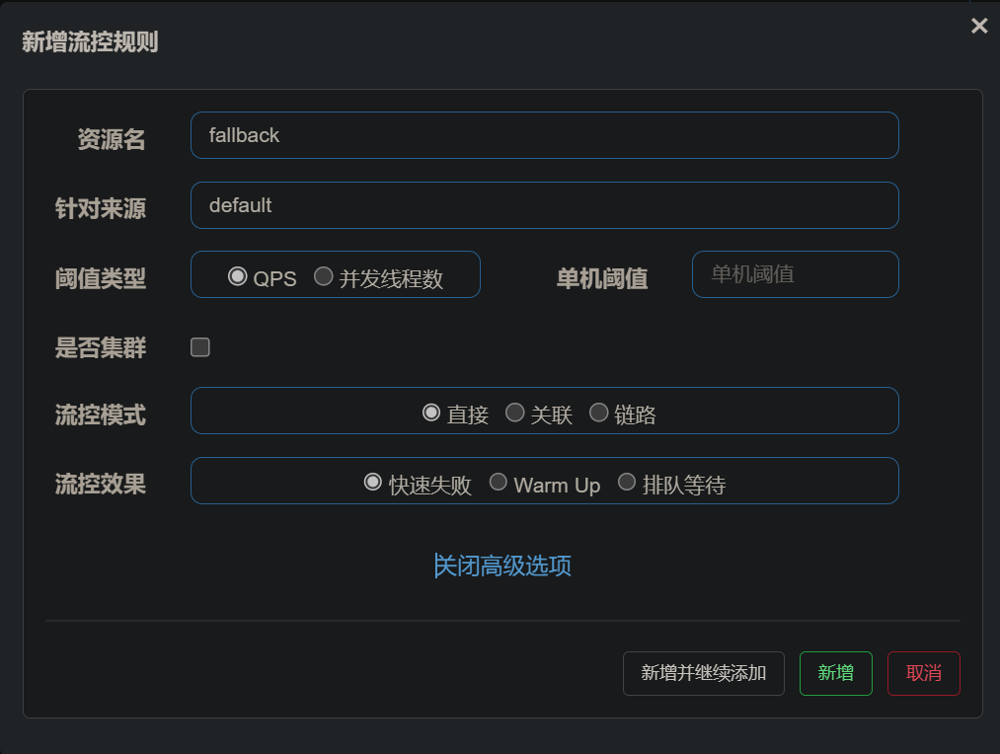
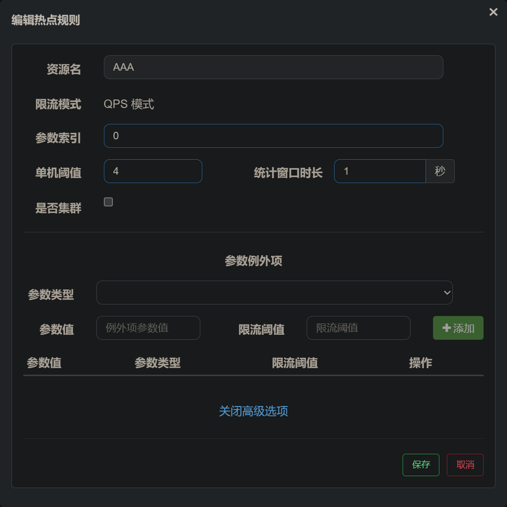
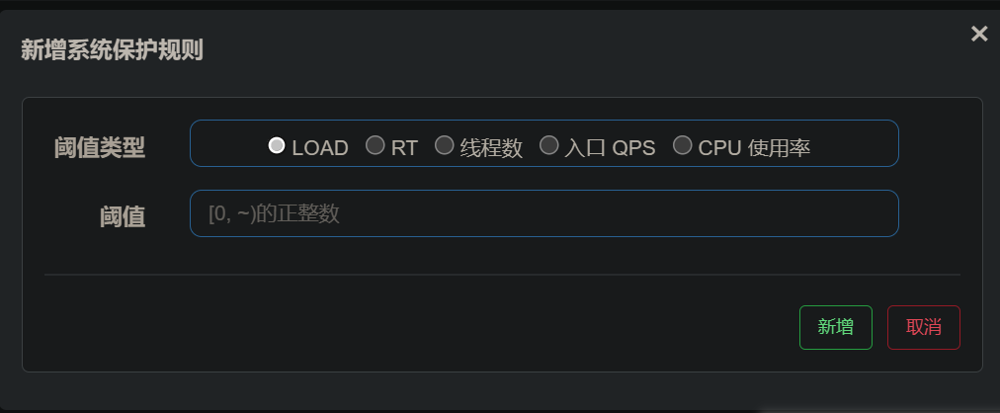
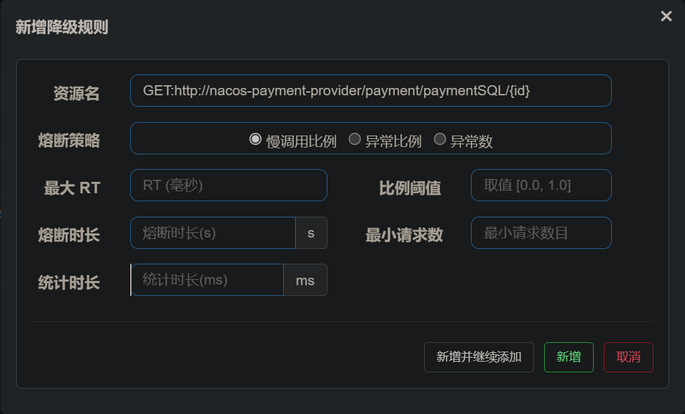

# SpringCloud

## 什么是微服务框架      &#x20;

微服务是一种将**单体应用**拆分成**多个小型、自治的服务**的**架构风格和设计方法**。每个服务都通过**API接口进行通信**[^注释1]，可以**独立开发、测试、部署和扩展。**

1.  架构风格和设计方法：微服务是一种分布式架构风格和设计方法，用于构建复杂的应用程序。它将单个应用程序拆解为多个小而自治的服务。
2.  独立部署：每个服务都可以独立进行开发、测试和部署，不会影响其他服务的运行。这样可以实现快速迭代和灵活性的提高。
3.  支持敏捷开发和快速部署：微服务架构可以更好地支持敏捷开发和快速部署。每个服务可以独立开发和测试，可以通过自动化工具实现快速部署和持续集成。
4.  复杂性和管理挑战：微服务架构相对于传统的单体应用程序架构会更加分散、复杂和难以管理。需要考虑服务间的通信、安全性、管理和监控等方面来解决这些挑战。

$微服务架构是一种$$灵活$$、$$可扩展和可管理的架构风格$$，适用于$$构建大型、复杂和需要快速迭代的应用程序。$

## 什么是分布式开发

《分布式系统原理与范型》定义：“分布式系统是**若干独立计算机的集合**，这些计算机**对于用户**来说就像**单个相关系统**”。

**分布式是指将不同的业务分布在不同的地方。**

[分布式系统](https://www.zhihu.com/search?q=分布式系统\&search_source=Entity\&hybrid_search_source=Entity\&hybrid_search_extra={"sourceType":"answer","sourceId":2975348973} "分布式系统")是由多个独立的计算机节点组成的系统，这些节点通过网络协作完成任务。每个节点都有自己的独立计算能力和存储能力，可以独立运行。分布式系统的目标是提高系统的可靠性、可扩展性和性能。

## 什么是集群

集群是指将多个独立的计算机或服务器连接在一起，以实现协同工作和共享资源的系统。这些计算机或服务器被称为集群节点，它们通过网络进行通信和协调，以达到更高的性能、可靠性和可扩展性。

**集群指的是将几台服务器集中在一起，实现同一业务。**

## 集群和分布式的联系

**分布式的每一个节点，都可以做集群，而集群并不一定就是分布式的。**

## 分布式系统的各个服务之间互相交互方式&#x20;

### RPC

`RPC【Remote ProcedureCall】`是指远程过程调用，是一种进程间通信方式，他是一种技术的思想，而不是规范。

它允许程序调用另一个地址空间（通常是共享网络的另一台机器上）的过程或函数，而不用程序员显式编码这个远程调用的细节。

即程序员无论是调用本地的还是远程的函数，本质上编写的调用代码基本相同。
可以使用**Socket通信的方式 传递数据** + **序列化数据传递**

**流程**

客户端 → 序列化发送消息 → 提供服务方反序列化 调用本地服务 → 进行服务处理 → 返回结果将结果序列化 → 返回消息 进行反序列化

→返回调用结果

### Rest

使用HTTP协议进行通信&#x20;

通常使用JSON 的格式进行数据的传递

通信接口通常使用RESTful风格

## 衡量高并发的标准

### 响应时间(RT)

请求做出响应的时间，即一个http请求返回所用的时间

### 吞吐量

系统在单位时间内处理请求的数量

### `QPS(Query/Request Per Second)` 每秒处理的查询数量

### `TPS（Transaction Per Second）`每秒处理的事物数量

### 并发用户数

承载的正常使用系统功能的用户的数量

## 高可用策略

### 服务集群部署

### 数据库主从+双机热备

#### 主-备方式（Active-Standby方式）

主-备方式即指的是一台服务器处于某种业务的激活状态（即Active状态），另一台服务器处于该业务的备用状态（即Standby状态)。

#### 双主机方式（Active-Active方式）

双主机方式即指两种不同业务分别在两台服务器上互为主备状态（即Active-Standby和Standby-Active状态）

## 注册中心

```text
注册中心是服务实例信息的存储仓库，也是服务提供者和服务消费者进行交互的桥梁。

在微服务框架和分布式开发中不同的服务和节点之间通信的桥梁

服务提供者可以在注册中心保留实例信息

方便服务消费者发现
```

```yaml
#  这个配置则是本服务注册中心的名称 
spring:
  application:
    name: spring-cloud-8001

```

## 负载均衡

### 目的

尽力将网络流量平均分发到多个服务器上，以提高系统整体的响应速度和可用性。

### 负载均衡算法（策略）

1.  轮询（Round Robin）算法：将请求依次轮流分配给后端服务器，**平均分配负载**。适用于**后端服务器性能相近**的情况。
2.  加权轮询（Weighted Round Robin）算法：给每个后端服务器分配一个权重值，**根据权重值进行轮询分配请求**。适用于**后端服务器性能不均衡**的情况。
3.  最少连接（Least Connections）算法：根据当前**连接数选择负载最轻的**后端服务器，减少负载较大的服务器上的连接数。适用于后端服务器性能不均衡的情况。
4.  IP哈希（IP Hash）算法：根据客户端的IP地址进行哈希计算，将同一客户端的请求分发到同一台后端服务器，**可以保持会话一致性**。
5.  最短响应时间（Least Response Time）算法：根据后端服务器的响应时间选择**负载最轻的服务器**，减少响应时间较长的服务器上的负载。
6.  随机分配（Random）：就是随机选择一个后端服务器来处理客户端的请求

## 服务雪崩

服务雪崩是指在一个分布式系统中，当某个服务出现故障或者异常时，该服务的负载会迅速转移到其他正常的服务上，导致这些服务也因负载过重而无法正常工作，最终导致整个系统崩溃的现象。

也就是当多个服务链式调用的时候 出现单个服务故障导致的请求堆积 扩散到调用它的服务 导致其他的服务也发生请求堆积导致性能下降或者损坏异常

## 熔断机制

熔断机制（Circuit Breaker）是一种用于保护分布式系统的重要设计模式，用于处理服务故障或异常情况，防止连锁反应和**服务雪崩**。

### 熔断机制的工作原理

1.  监控：熔断器会监控特定服务的调用情况，包括请求成功率、平均响应时间等指标。
2.  判断：当被监控的服务出现故障或者异常情况时，熔断器会判断当前的服务状态是否达到了触发熔断的条件。
3.  熔断：当触发熔断条件时，熔断器会立即中断对该服务的请求调用，并返回一个预先设定的错误响应，不再尝试调用服务。
4.  半开状态：在一段时间后，熔断器会允许一个或多个请求通过，以检测服务是否已经恢复正常。
5.  恢复：如果检测到服务正常运行，熔断器会关闭熔断状态，重新允许请求调用服务。
6.  继续监控：在恢复状态后，熔断器会继续监控该服务的调用情况，以便在再次出现故障时及时触发熔断。

### 熔断的三种状态

1.  关闭状态（Closed State）：在关闭状态下，熔断器正常工作，允许请求通过。所有的请求都会直接转发到被保护的服务。此时，熔断器会监控服务的调用情况。
2.  打开状态（Open State）：当熔断器处于打开状态时，它会立即拒绝所有请求，而不会调用被保护的服务。在这个状态下，请求可以快速失败，而不会等待超时。这样可以避免与故障的服务进行通信，节省系统资源。
3.  半开状态（Half-Open State）：在打开状态持续一段时间后，熔断器会进入半开状态。在半开状态下，熔断器允许一部分请求通过，以检测被保护的服务是否已经恢复正常。如果这些请求成功，则熔断器会认为服务已经恢复，将状态切换回关闭状态；如果这些请求失败，则熔断器会切换回打开状态，继续拒绝请求。

### 熔断的优势

1.  快速失败：当服务出现故障时，熔断机制能够快速失败并返回错误响应，避免等待超时或者无限阻塞的问题。
2.  防止连锁反应：通过及时熔断故障服务，可以防止故障蔓延到整个系统，减少系统崩溃的风险。
3.  降级保护：通过返回预设错误响应，可以提供降级服务，保护核心业务不受影响。

## 服务器限流

服务器限流是一种控制服务器处理请求的策略，用于保护服务器免受过载和资源耗尽的风险。通过限制请求的数量或速率，可以平衡服务器的负载，确保稳定的性能和可靠的服务。

### 常见的限流策略

1.  请求数量限流：限制同时处理的请求数量，可以通过设置最大并发连接数或队列长度来实现。当请求数达到限制时，服务器将拒绝进一步的请求，直到有处理能力空闲出来为止。
2.  请求速率限流：限制单位时间内处理的请求数量，可以使用**令牌桶算法**[^注释2]或**漏桶算法**[^注释3]等算法来控制请求的速率。这样可以均匀分布请求的到达，避免瞬时高峰对服务器造成冲击。
3.  IP/用户限流：针对同一个IP地址或用户进行限流，防止某个IP或用户对服务器进行过度请求。可以设置每个IP或用户在单位时间内能够发送的请求数量或速率限制。
4.  API接口限流：对特定的API接口进行限流，防止某个接口被频繁请求而导致过载。可以根据每个接口的处理能力和重要性，设置不同的限流策略。
5.  动态限流：根据服务器的当前负载情况动态调整限流策略。可以通过监控服务器的资源使用情况，如CPU、内存、网络等，来动态调整限流参数，以适应实时变化的请求负载。

## API网关

API网关（API Gateway）是一个位于服务端和客户端之间的中间层，用于管理和调度多个后端API服务。它充当了客户端和后端服务之间的代理，提供了一种集中式的方式来处理API请求。

### API网关主要功能

1.  路由与转发：API网关作为系统的入口点，负责接收外部请求并根据预定义的路由规则将请求路由到相应的微服务。它能够将请求转发给正确的服务实例，并确保请求的正确性和完整性。
2.  负载均衡：API网关可以通过负载均衡算法将请求分发到多个可用的服务实例上。这样可以平衡每个服务实例的负载，提高系统的性能和可扩展性。
3.  认证与授权：API网关可以实现用户认证和授权，以确保只有经过身份验证和授权的用户才能访问受保护的API。它可以集成各种身份验证机制，如基于令牌的认证、OAuth等，同时对请求进行权限验证和访问控制。
4.  安全性与防护：API网关可以实施安全策略，包括加密传输、防止恶意攻击（如DDoS攻击）、限制请求频率等。它可以对请求进行过滤和检查，以确保系统的安全性和可靠性。
5.  监控与日志：API网关可以收集和记录请求的相关信息，如请求量、响应时间、错误代码等，以用于系统的监控和故障排查。它可以生成日志和统计数据，帮助开发团队识别性能问题和改进系统设计。
6.  缓存与性能优化：API网关可以缓存常用的请求结果，减少对后端服务的请求次数，提高系统的响应速度和性能。它可以通过缓存策略来优化请求处理，并管理缓存的一致性和过期策略。
7.  API版本控制：API网关可以支持多个API版本的并存和管理，允许不同版本的客户端使用不同的API接口。它可以根据请求中的版本信息，将请求路由到相应的API版本。
8.  熔断：当某个服务发生故障或超时时，API网关可以检测到异常情况，并暂时中断对该服务的请求转发。这样可以防止故障服务进一步影响整个系统的正常运行。熔断器会记录故障状态，当达到一定阈值后，将直接拒绝请求，不再转发给故障服务，从而避免服务雪崩效应。
9.  重试：当某个服务的请求失败时，API网关可以尝试重新发送请求，以期望下一次尝试可以成功。重试策略可以根据需要进行配置，如设置最大重试次数、重试间隔时间等。通过重试机制，可以提高对故障服务的容错能力，增加请求的成功率。

## 弹性云（Elastic Cloud）

是指一种基于云计算技术的资源扩展和收缩能力，可以根据需求自动调整资源配置的云服务模型。它允许用户根据实际需求弹性地增加或减少计算、存储和网络等资源，并按照实际使用量进行付费。

### 弹性云的主要特点

1.  弹性扩展：弹性云可以根据用户的需求自动扩展计算和存储资源。当系统负载增加时，它可以自动增加服务器实例数量或调整计算能力，以满足高负载需求。当负载减少时，它可以自动释放多余的资源，减少成本和资源浪费。
2.  弹性存储：弹性云提供了具有弹性扩展能力的存储服务。用户可以根据需求自动扩展存储容量，无需担心数据存储不足的问题。此外，弹性云还支持数据备份和容灾，确保数据的安全性和可靠性。
3.  弹性网络：弹性云提供了可弹性调整的网络资源，可以根据需要调整网络带宽、连接数和交换机等网络设备。这样可以保证网络的稳定性和性能，并满足用户对网络资源的灵活需求。
4.  弹性计费：弹性云按照实际使用量进行计费，用户只需支付实际使用的资源和服务，无需提前投入大量资金购买硬件设备或长期租赁服务器。这样可以节省成本，并根据业务需求灵活地调整资源配置。
5.  高可靠性：弹性云通常部署在分布式的数据中心，具备高可靠性和容灾能力。它可以自动监测和处理故障，确保业务连续性和可用性。同时，弹性云还支持快速备份和恢复，可以有效应对各种灾难和数据丢失的情况。

弹性云的出现极大地提高了企业和个人在云环境下的灵活性和效率。它可以根据不同的业务需求和负载情况自动调整资源配置，提供高度可扩展和弹性的云服务。这使得用户可以更加高效地利用云资源，同时减少了资源的浪费和成本的支出。

## 服务跟踪（Service Tracing）

是指对分布式系统中的服务进行监控和追踪的过程。它可以记录和可视化整个请求链路中的服务调用情况，帮助开发人员和运维人员了解系统的性能状况、定位问题和优化性能。

在微服务架构中，一个请求通常会经过多个服务的处理和调用，每个服务都会产生相应的日志和指标。服务跟踪可以将这些日志和指标收集起来，构建出完整的请求链路图，显示每个服务之间的依赖关系和调用流程。通过服务跟踪，可以实现以下功能：

1.  请求追踪：服务跟踪可以追踪一个请求从发起到完成的整个过程，记录每个服务的处理时间、错误信息等关键指标。这样可以分析请求的执行路径，了解每个服务的性能和耗时情况，发现潜在的性能瓶颈和问题所在。
2.  依赖关系分析：服务跟踪可以根据请求链路图，分析不同服务之间的依赖关系和调用流程。这对于理解系统的拓扑结构、优化服务调用以及进行容错处理都非常有帮助。例如，当某个服务出现故障或性能问题时，可以通过服务跟踪追溯到请求链路中的其他服务，快速锁定问题所在。
3.  性能分析和优化：通过对服务跟踪数据进行统计和分析，可以得到各个服务的性能指标、调用频率、执行时间等信息。这有助于评估系统的整体性能，并找出影响系统性能的瓶颈。基于这些分析结果，可以采取相应的优化措施，提高系统的性能和可扩展性。
4.  异常排查：当系统出现异常或错误时，服务跟踪可以帮助定位问题，追溯异常发生的原因和路径。它可以提供请求链路中每个服务的日志和错误信息，帮助开发人员快速定位和解决问题。

## Eureka（服务的注册和发现）

### 作用

以实现`服务调用`，`负载均衡`、`容错`等，实现`服务发现`与`注册`。

### Eureka的两大组件

#### **EurekaServer提供服务注册服务**

这样Eureka Server中的服务注册表中将会存储所有可用服务节点的信息，服务节点的信息可以在界面中直观看到。

```xml
        <!-- 引入依赖 -->
        <dependency>
            <groupId>org.springframework.cloud</groupId>
            <artifactId>spring-cloud-starter-netflix-eureka-server</artifactId>
        </dependency>

```

```yaml
#端口设置
server:
  port: 8003
#  这个配置则是本服务注册中心的名称
spring:
  application:
    name: spring-cloud-8001
eureka:
#  Eureka服务器的地址
  instance:
    hostname: 127.0.0.1
  client:
#    因为eureka的服务端也是客户端所以需要配置
#    表示该服务提供者不会将自身的服务注册到 Eureka 注册中心中。
    register-with-eureka: false
#    表示服务提供者将不会从注册中心获取其他服务的注册信息
    fetch-registry: false
#    eureka服务器路径 如果这个是服务器将他的路径指向自己
    service-url:
      defaultZone: https://${eureka.instance.hostname}:9002/eureka

```

```java
@SpringBootApplication
@EnableEurekaServer
public class SpringBootApplicationEureka {
    public static void main(String[] args) {
        SpringApplication.run(SpringBootApplicationEureka.class,args);
    }
}
```

#### Eureka 的高可用

如果只有一个Eureka  的服务端 且服务端发生了故障 会导致所有的客户端无法使用

可以配置多个Eureka 的服务端互相注册 一个故障了可以使用其他的&#x20;

#### Eureka 的客户端注册

```xml
        <!--引入依赖-->
        <dependency>
            <groupId>org.springframework.cloud</groupId>
            <artifactId>spring-cloud-starter-netflix-eureka-client</artifactId>
        </dependency>
```

```yaml
eureka:
  client:
    register-with-eureka: true
    fetchRegistry: true
    service-url:
      defaultZone: http://127.0.0.1:9001/eureka,http://127.0.0.1:9002/eureka
```

```java
@SpringBootApplication
@EnableEurekaClient
public class MySpringBootApplication {
    public static void main(String[] args) {
        SpringApplication.run(MySpringBootApplication.class,args);
    }
}
```

## RestTemplate（服务之间HTTP通信）

```java
//     将这个类交给Spring容器管理
     @Bean
//     RestTemplate 支持 Ribbon 开启负载均衡
     @LoadBalanced
    public RestTemplate restTemplate(){
        return new RestTemplate();
     }
```

### 方法

1.  方法名命名规则 请求类型 + for + `Object `/ `Entity `
2.  &#x20;`object `是直接返回 返回的数据
3.  `Entity `是返回一个对象包含 `响应头 相应码 响应体`等内容

## Ribbon（负载均衡）

### 简介

1.  集中式

    即在服务的消费方和提供方之间使用独立的负载均衡设施（可以是硬件，如F5，也可以是软件，如Nginx）,由该设施负责把访问请求通过某种策略转发至服务的提供方；
2.  进程内

    将负载均衡逻辑集成到消费方，消费方从服务注册中心获知有哪些地址可用，然后自己再从这些地址中选择出一个合适的服务器。

    Ribbon就属于进程内LB，它只是一个类库，集成于消费方进程，消费方通过它来获取到服务提供方的地址。
3.  Ribbon**的本地负载均衡客户端** **VS** Nginx**服务端负载均衡区别**：

    Nginx是服务器负载均衡，客户端所有请求都会交给Nginx，然后，由nginx实现转发请求。即负载均衡是由服务器端完成的。

    Ribbon本地负载均衡，在调用微服务接口时候，会在注册中心上获取注册信息服务列表之后缓存到JVM本地，从而在本地实现RPC远程服务调用

### 开启

如果使用的是`RestTemplate` 加上`@LoadBalanced` 注解可以让 `RestTemplate` 对象支持负载均衡

### 更换默认负载均衡策略

1.  书写一个配置类
    ```java
    @Configuration
    public class MyRule {
        @Bean
        // IRule 是所有策略的父接口
        public IRule iRule(){
         //  这个是随机的策略
            return new RandomRule();
        }
    }
    ```
2.  这个类需要放置到`@ComponentScan` 注解扫描不到的地方 如果被扫描到该客户端的所有的访问的服务提供方都会使用该负载均衡策略失去了对不同服务的针对性
3.  在springboot启动类中书写注解
    ```java
    // 可以配置多个对服务提供者的负载均衡策略
    @RibbonClients(value = {
            // 服务提供方                                // 均衡策略
            @RibbonClient(name = "spring-cloud-8001" , configuration = MyRule.class)
    })
    ```

### Ribbon的负载均衡策略

1.  **RoundRobinRule**（轮询）：按顺序逐个选择可用的服务实例，循环进行请求分发。
2.  **RandomRule**（随机）：随机选择一个可用的服务实例来处理每个请求。
3.  **RetryRule**（重试）：在一定时间内进行重试，选择一个可用的服务实例。默认情况下，每个服务实例将在30秒内重试2次。
4.  **WeightedResponseTimeRule**（加权响应时间）：根据服务实例的平均响应时间和权重来选择实例。响应时间越短且权重越高的实例被选中的概率越大。
5.  **BestAvailableRule**（最佳可用）：排除故障实例，并选择并发量最低的可用实例进行请求。
6.  **AvailabilityFilteringRule**（可用性过滤）：根据可用性过滤掉故障实例，然后按照指定策略（默认为轮询）选择一个实例。
7.  **ZoneAvoidanceRule**（区域避免）：根据区域来选择可用的服务实例，避免选择同一区域的实例。
8.  **Custom Rule**（自定义规则）：您可以根据自己的需求实现自定义的负载均衡规则。

**ZoneAvoidanceRule**（区域避免）是RIbbon的默认策略 只是在单机环境效果与 **RoundRobinRule**（轮询）一样

## OpenFeign（声明式的web服务客户端）

### 简介

OpenFeign是一个**声明式的**、**基于注解的HTTP客户端框架**，用于**简化和优化服务之间的通信**。它是Spring Cloud生态系统中的一部分，旨在提供一种更简单、更优雅的方式来编写基于HTTP的服务调用代码。

使用接口映射，通过动态代理让服务之间的通信像调用本地方法一样方便。默认支持Ribbon 负载均衡

### 主要特征

1.  声明式API：通过定义标准的Java接口和注解，您可以对远程服务的API进行描述，而不需要手动编写客户端代码。
2.  内置负载均衡：OpenFeign集成了Ribbon负载均衡器，在服务调用时可以自动进行负载均衡和多实例选择。
3.  容错支持：通过与Hystrix的集成，OpenFeign可以提供对远程服务的容错支持，例如超时处理、断路器、降级等。
4.  整合服务注册与发现：OpenFeign可以与Eureka或其他服务注册中心集成，使得服务消费方能够轻松地发现和调用远程服务。
5.  自动编码和解码：OpenFeign能够自动将HTTP请求和响应转换为Java对象，简化了数据传输的过程。

### Feign和OpenFeign两者区别

Feign 是一个独立的项目，而 `OpenFeign `是 `Spring Cloud 在 Feign` 基础上进行了扩展和封装。

1.  组织结构：Feign 是一个独立的项目，由 Netflix 开发和维护。而 OpenFeign 是 Spring Cloud 中的一个子项目，它在 Feign 的基础上进行了扩展和封装，以便更好地集成到 Spring Cloud 生态系统中。
2.  注解支持：OpenFeign 提供了比 Feign 更丰富的注解支持。例如，OpenFeign 支持使用 `@RequestMapping`、`@GetMapping`、`@PostMapping` 等常见的 Spring MVC 注解，这样可以更好地与 Spring Boot 应用程序集成。
3.  自动装配：OpenFeign 可以通过 `@EnableFeignClients` 注解自动进行客户端的注册和装配。这个注解可以在 Spring Boot 应用程序的主类上使用，无需手动创建 Feign 客户端的实例。而 Feign 则需要显式地创建 Feign 客户端的实例并注册到 Spring 容器中。
4.  默认配置：OpenFeign 有一组默认的配置属性，可以通过配置文件或代码进行自定义。这些默认配置包括连接超时、读取超时等。而 Feign 则需要手动配置相应的属性。
5.  兼容性：由于 `OpenFeign `是 Spring Cloud 的一部分，它与其他 Spring Cloud 组件（如 `Ribbon`、`Hystrix`、`Eureka `等）的集成更加方便和无缝。而 Feign 原生的集成可能需要更多的配置和额外的工作。

### 使用

1.  引入依赖
    ```xml
            <dependency>
                <groupId>org.springframework.cloud</groupId>
                <artifactId>spring-cloud-starter-openfeign</artifactId>
            </dependency>
    ```
2.  配置映射接口
    ```java
    //服务的名字
    @FeignClient(value = "SPRING-CLOUD-8001")
    public interface PaymentFeignService {
    //    url路径包括层级
        @PostMapping("/payment")
    //    方法名无所谓 返回值和形参（类型 名称 位置）需要一致
        CommonResult<Payment> insertPayment(Payment payment);

        @GetMapping("/payment/{id}")
        CommonResult<Integer> selectById(@PathVariable(value = "id") Long id);
        @GetMapping("/payment")
        public String timeOutTest();
    }
    ```
    1.  需要映射的服务在注册中心的名称
    2.  方法的请求的URL路径需要一致包括层级
    3.  方法的返回值和形参[^注释4]需要一致
3.  在启动主类添加一个注解`@EnableFeignClients(basePackages = "com.java.service")`&#x20;
    ```java
    @SpringBootApplication
    @EnableEurekaClient
    @RibbonClients(value = {
            @RibbonClient(name = "spring-cloud-8001" , configuration = MyRule.class)
    })
    @EnableFeignClients(basePackages = "com.java.service")
    public class MySpringBootApplication {

        public static void main(String[] args) {
            SpringApplication.run(MySpringBootApplication.class,args);
        }

    }
    ```

### 日志打印

1.  配置类配置日志对象
    ```java
        import feign.Logger;
        
        @Bean
        public Logger.Level level(){
            return Logger.Level.FULL;
        }
    ```
2.  OpenFeign的四种日志级别
    ```text
    NONE：没有日志记录
    BASIC：记录请求方法、URL以及响应状态代码和执行时间
    HEADERS：记录基本信息以及请求和响应头信息
    FULL：记录基本信息以及请求和响应头信息、请求和响应体信息

    ```
3.  配置`application.yml`文件
    ```java
    logging:
      level:
        com:
          java:
            service:
              PaymentFeignService: debug
    ```

### 超时控制

#### Ribbon 超时控制

修改`application.yml` 配置文件

```java
ribbon:
  ReadTimeout: 4000 #响应最大超时时间
  ConnectTimeout: 4000 #连接建立最大超时时间
  MaxAutoRetries: 1 #同一台实例最大重试次数,不包括首次调用
  MaxAutoRetriesNextServer: 1 #重试负载均衡下次的实例最大重试次数,不包括首次调用 重试其他的实例重试重试的实例并不一定是同一个实例
  如果 一共有5个服务实例  重试会进行一定算法轮询 
  OkToRetryOnAllOperations: false #是否所有操作都重试 如果是false只是重试读的操作 true 读写都会重试
```

`MaxAutoRetries + MaxAutoRetriesNextServer + (MaxAutoRetries * MaxAutoRetriesNextServer) 即重试3次 则一共产生4次调用`

#### 关于重试其他实例配置的解释（`MaxAutoRetriesNextServer`）

如果有五台实例可用，MaxAutoRetriesNextServer参数设置为3，那么在每个请求中，Ribbon会首先选择其中的一台实例处理该请求。如果该实例处理请求失败，Ribbon会尝试选择另一台可用实例，重试次数为1。如果第二台实例也失败，Ribbon会再次尝试选择另一台可用实例，重试次数为2。如果第三台实例仍然失败，Ribbon会再次尝试选择另一台可用实例，重试次数为3。如果第四台实例还是失败，Ribbon会再次尝试选择另一台可用实例，但由于已经达到了最大重试次数，将返回错误信息。

#### OpenFeign超时控制

```yaml
feign:
  client:
    config:
      # 提供方的服务名
      spring-cloud-8001:
        #请求日志级别
        loggerLevel: full
        contract: feign.Contract.Default #设置为默认的契约（还原成原生注解）
        # 连接超时时间，默认2s，设置单位为毫秒
        connectTimeout: 5000
        # 请求处理超时时间，默认5s，设置单位为毫秒。
        readTimeout: 3000
```

## Hystrix断路器

Hystrix是Netflix开源的一款容错框架，主要用于分布式系统中的服务保护和故障隔离。它主要解决高并发下系统的雪崩效应和服务降级问题，可以防止因服务负载过高或服务不可用导致整个系统崩溃。
Hystrix的特点是具有弹性，能够根据负载情况自动调整服务的容量，还可以对服务进行实时`监控`和`统计`，及时发现并处理`服务降级`和`故障问题`，并提供了多种降级机制和容错策略。同时，它也具备线程池隔离和断路器模式等功能，可以保证分布式系统的`高可用性和稳定性`。

### Hystrix服务降级

服务降级是指在高负载或故障情况下，为了保证系统的稳定性和可用性，主动减少或停止一些非关键或消耗较大的服务功能，以保证核心功能的正常运行。通过服务降级，系统可以在资源有限或不可用的情况下，仍然能够提供一定程度的服务响应，避免出现整体系统崩溃或无法响应的情况。

**服务降级是为了保护服务消费端的一种行为**

#### 服务降级的触发场景

1.  高并发：当系统的请求数量超过系统处理能力的阈值时，为了保护核心功能的稳定运行，可以降低或停止一些非关键的服务，以减轻系统负载。
2.  资源限制：当系统资源（如内存、CPU等）达到上限，无法满足所有请求时，可以选择降级一些服务，以确保核心功能的正常运行。
3.  服务故障：当依赖的服务出现故障或不可用时，为了避免整体系统的故障，可以对相关功能进行降级处理，提供更好的用户体验。
4.  容灾备份：当主要服务出现故障或不可用时，可以启用备用的降级服务，以确保系统有一定的可用性。

总之就是 **下游服务 响应过慢** 或者 **不可用的时候** 为了保证 上游服务的稳定性和可用性 返回一个预定的值进行返回 从而快速释放资源

#### 使用Hystrix服务降级

1.  引入依赖
    ```xml
            <dependency>
                <groupId>org.springframework.cloud</groupId>
                <artifactId>spring-cloud-starter-netflix-hystrix</artifactId>
            </dependency>

    ```
2.  主启动类添加注解`@EnableCircuitBreaker`
3.  设置服务降级注解(方法上书写)
    ```java
        // fallbackMethod 是降级方法 commandProperties 是一个集合设置的是属性 比如超时时间 
        @HystrixCommand(fallbackMethod = "timeOutHandler" , commandProperties = {
                @HystrixProperty(name = "execution.isolation.thread.timeoutInMilliseconds",value = "3000")
        })
    ```
4.  全局服务降级的设置(类上书写)
    ```java
    // defaultFallback 设置的是通用降级服务的方法
    @DefaultProperties(defaultFallback = "errorHandler") 
    ```

通常用来在服务提供端书写 保护服务消费端

#### 使用FeignHystrix服务降级

1.  引入依赖
    ```xml
            <dependency>
                <groupId>org.springframework.cloud</groupId>
                <artifactId>spring-cloud-starter-netflix-hystrix</artifactId>
            </dependency>
            <dependency>
                <groupId>org.springframework.cloud</groupId>
                <artifactId>spring-cloud-starter-openfeign</artifactId>
            </dependency>
    ```
2.  主启动类添加注解`@EnableHystrix`
3.  实现`@FeignClient` 接口 加上`@Component` 注解添加到Spring容器管理 在重写方法中可以书写降级的服务

通常用于服务消费端保护自身服务

### Hystrix熔断[^注释5]

配置方法上注解（和服务降级是一个注解）

```java
    @HystrixCommand(fallbackMethod = "paymentCircuitBreakerHandler",commandProperties = {
            // 是否开启
            @HystrixProperty(name = "circuitBreaker.enabled",value = "true"),
            // 错误请求多少个触发熔断 开启 （在一个时间区间默认为10s 默认值为20个）
            @HystrixProperty(name = "circuitBreaker.requestVolumeThreshold",value = "2"),
            // 触发了熔断之后的 开启时间 单位是毫秒 
            @HystrixProperty(name = "circuitBreaker.sleepWindowInMilliseconds" , value = "100000"),
            // 错误请求在一个时间区间的占比的占比（时间区间默认为10s） 开启熔断 （默认值50%）
            @HystrixProperty(name = "circuitBreaker.errorThresholdPercentage" , value = "60"),
    })
```

### Hystrix服务监控

#### 监控的模块

1.  导入依赖
    ```java
            <!--新增hystrix dashboard-->
            <dependency>
                <groupId>org.springframework.cloud</groupId>
                <artifactId>spring-cloud-starter-netflix-hystrix-dashboard</artifactId>
            </dependency>
            <dependency>
                <groupId>org.springframework.boot</groupId>
                <artifactId>spring-boot-starter-actuator</artifactId>
            </dependency>
    ```
2.  设置配置文件
    ```java
    server:
      port: 9001

    ```
3.  SpringBoot启动类注解添加`@EnableHystrixDashboard`
4.  打开本模块的网站 + "`/hystrix`"
5.  在网站输入要监控的接口的`URL` + `"/hystrix.stream"`

#### 需要被监控的模块

1.  添加依赖
    ```xml
    <dependency>
        <groupId>org.springframework.boot</groupId>
        <artifactId>spring-boot-starter-actuator</artifactId>
    </dependency>

    ```
2.  添加bean到spring容器
    ```java
    /**
     *此配置是为了服务监控而配置，与服务容错本身无关，springcloud升级后的坑
     *ServletRegistrationBean因为springboot的默认路径不是"/hystrix.stream"，
     *只要在自己的项目里配置上下面的servlet就可以了
     */
    @Bean
    public ServletRegistrationBean getServlet() {
        HystrixMetricsStreamServlet streamServlet = new HystrixMetricsStreamServlet();
        ServletRegistrationBean registrationBean = new ServletRegistrationBean(streamServlet);
        registrationBean.setLoadOnStartup(1);
        registrationBean.addUrlMappings("/hystrix.stream");
        registrationBean.setName("HystrixMetricsStreamServlet");
        return registrationBean;
    }


    ```

## Gateway（网关）

### 网关

API网关（API Gateway）是一个位于服务端和客户端之间的中间层，用于管理和调度多个后端API服务。它充当了客户端和后端服务之间的代理，提供了一种集中式的方式来处理API请求。

#### API网关主要功能

1.  路由与转发：API网关作为系统的入口点，负责接收外部请求并根据预定义的路由规则将请求路由到相应的微服务。它能够将请求转发给正确的服务实例，并确保请求的正确性和完整性。
2.  负载均衡：API网关可以通过负载均衡算法将请求分发到多个可用的服务实例上。这样可以平衡每个服务实例的负载，提高系统的性能和可扩展性。
3.  认证与授权：API网关可以实现用户认证和授权，以确保只有经过身份验证和授权的用户才能访问受保护的API。它可以集成各种身份验证机制，如基于令牌的认证、OAuth等，同时对请求进行权限验证和访问控制。
4.  安全性与防护：API网关可以实施安全策略，包括加密传输、防止恶意攻击（如DDoS攻击）、限制请求频率等。它可以对请求进行过滤和检查，以确保系统的安全性和可靠性。
5.  监控与日志：API网关可以收集和记录请求的相关信息，如请求量、响应时间、错误代码等，以用于系统的监控和故障排查。它可以生成日志和统计数据，帮助开发团队识别性能问题和改进系统设计。
6.  缓存与性能优化：API网关可以缓存常用的请求结果，减少对后端服务的请求次数，提高系统的响应速度和性能。它可以通过缓存策略来优化请求处理，并管理缓存的一致性和过期策略。
7.  API版本控制：API网关可以支持多个API版本的并存和管理，允许不同版本的客户端使用不同的API接口。它可以根据请求中的版本信息，将请求路由到相应的API版本。
8.  熔断：当某个服务发生故障或超时时，API网关可以检测到异常情况，并暂时中断对该服务的请求转发。这样可以防止故障服务进一步影响整个系统的正常运行。熔断器会记录故障状态，当达到一定阈值后，将直接拒绝请求，不再转发给故障服务，从而避免服务雪崩效应。
9.  重试：当某个服务的请求失败时，API网关可以尝试重新发送请求，以期望下一次尝试可以成功。重试策略可以根据需要进行配置，如设置最大重试次数、重试间隔时间等。通过重试机制，可以提高对故障服务的容错能力，增加请求的成功率。

### 简介

Gateway旨在提供一种简单而有效的方式来对API进行路由，以及提供一些强大的**过滤器**功能，例如：**熔断**、**限流**、**重试** 等

1.  反向代理
2.  &#x20;权限控制
3.  流量控制
4.  熔断
5.  日志监控
6.  。。。。。。。

### 三大核心概念

#### Route(路由)

路由是构建网关的基本模块，它由`ID`，目标`URI`，一系列的`断言`和`过滤器`组成，如果断言为true则匹配**该路由**

#### Predicate（断言）

可以匹配HTTP请求中的所有内容（例如请求头或请求参数），如果请求与断言相匹配则进行路由 **常用断言**

1.  After 之后   可放置时间 在这个时间之后可以访问
2.  Before 之前 可放置时间 在这个时间之前可以访问
3.  Between 之间  放置两个时间参数 在这两个时间之间可以访问
4.  Cookie  匹配Cookie 中的参数 `- Cookie=KEY,VALUE`
5.  Header  请求头匹配&#x20;
6.  Host  主机名匹配 只允许 这个主机名可以匹配
7.  Method   限制请求方式  GET或者POST或者其他请求方式
8.  Path  只允许这个路径访问 可以防止通配符
9.  Query  匹配参数 只有请求携带匹配参数的时候才可以访问
10. 。。。。。。

#### Filter过滤器

#### 局部过滤器和全局过滤器的优先级

1.  首先，局部过滤器会拦截并处理适用于特定接口或网络段的流量。如果局部过滤器规则匹配并确定处理该流量，则该规则优先生效。
2.  如果局部过滤器未能匹配流量或未对其进行处理，则网关会将流量传递给全局过滤器。
3.  全局过滤器会对剩余的流量进行过滤，并根据全局过滤器规则确定是否允许或阻止该流量。

**因此，局部过滤器的优先级高于全局过滤器**

#### 局部过滤器

局部过滤器是针对每个路由的过滤器官方提供了30种过滤器

**常用的局部过滤器：**

1.  `AddRequestHeader`：用于向请求头中添加指定的请求头信息。
2.  `AddRequestParameter`：用于向请求参数中添加指定的参数。
3.  `PrefixPath`：用于给请求路径添加前缀。
4.  `RemoveRequestHeader`：用于移除请求头中指定的请求头信息。
5.  `RemoveRequestParameter`：用于移除请求参数中指定的参数。
6.  `RewritePath`：用于重写请求路径，可以使用正则表达式进行匹配和替换。
7.  `RewriteResponseHeader`：用于重写响应头中指定的响应头信息。
8.  `SetPath`：用于设置请求路径，可以在请求路径中插入变量。
9.  `SetRequestHeader`：用于设置请求头中指定的请求头信息。
10. `SetRequestHostHeader`：用于设置请求头中的 Host 头信息。
11. `SetRequestParameter`：用于设置请求参数中指定的参数。
12. `SetResponseStatus`：用于设置响应状态码。

#### 全局过滤器

通过实现自定义过滤器实现 `Ordered`接口 和 `GlobalFilter`接口&#x20;

1.  `getOrder()` 方法的返回值是 每个过滤器都有一个顺序值，值越小表示优先级越高。在过滤器链中，按照顺序依次执行各个过滤器。如果多个过滤器具有相同的顺序值，则根据它们被注册的顺序来决定执行顺序。
2.  `filter()` 方法是过滤的内容&#x20;
    1.  `exchange `是请求和响应的封装对象
    2.  `chain` 用来放行请求
3.  使用`@Component` 注解将这个过滤器添加到spring容器中

### 启动配置

1.  导入依赖
    ```xml
     <!--新增gateway，不需要引入web和actuator模块-->
            <dependency>
                <groupId>org.springframework.cloud</groupId>
                <artifactId>spring-cloud-starter-gateway</artifactId>
            </dependency>

    ```
2.  application配置文件
    ```yaml
    server:
      port: 9527

    spring:
      application:
        name: cloud-gateway
      cloud:
        gateway:
          routes:
           - id: payment_routh #路由的ID，没有固定规则但要求唯一，建议配合服务名
             uri: http://localhost:8001   #匹配的地址路径
             predicates:
               - Path=/payment/get/**   #断言,路径相匹配的进行路由
     
           - id: payment_routh2
             uri: http://localhost:8001
             predicates:
               - Path=/payment/lb/**   #断言,路径相匹配的进行路由

    eureka:
      instance:
        hostname: cloud-gateway-service
      client:
        service-url:
          register-with-eureka: true
          fetch-registry: true
          defaultZone: http://localhost:7001/eureka


    ```
3.  通过服务名进行
    ```yaml
    server:
      port: 9527

    spring:
      application:
        name: cloud-gateway
      cloud:
        gateway:
          discovery:
            locator:
              enabled: true  #开启从注册中心动态创建路由的功能，利用微服务名进行路由
          routes:
            - id: payment_routh #路由的ID，没有固定规则但要求唯一，建议配合服务名
              #uri: http://localhost:8001   #匹配后提供服务的路由地址
              uri: lb://cloud-payment-service
              predicates:
                - Path=/payment/get/**   #断言,路径相匹配的进行路由
     
            - id: payment_routh2
              #uri: http://localhost:8001   #匹配后提供服务的路由地址
              uri: lb://cloud-payment-service
              predicates:
                - Path=/payment/lb/**   #断言,路径相匹配的进行路由

    eureka:
      instance:
        hostname: cloud-gateway-service
      client:
        service-url:
          register-with-eureka: true
          fetch-registry: true
          defaultZone: http://localhost:7001/eureka

    ```
4.  配置局部过滤器
    ```yaml
    server:
      port: 9527
    spring:
      application:
        name: spring-cloud-gateway
      cloud:
        gateway:
          discovery:
            locator:
              enabled: true
          routes:
            - id: payment_routh_1 #路由的ID，没有固定规则但要求唯一，建议配合服务名
              uri: lb://spring-cloud-hystrix-client   #匹配后提供服务的路由地址
              predicates:
                - Path=/order/ok/**   #断言,路径相匹配的进行路由

            - id: payment_routh_2
              uri: lb://spring-cloud-hystrix
              predicates:
                - Path=/ok/**   #断言,路径相匹配的进行路由
              filters:
                -PrefixPath=/order #给路径前缀拼接
    ```

## &#x20;SpringCloudSleuth分布式链路请求跟踪

在微服务框架中，一个由客户端发起的请求在后端系统中会经过多个不同的服务节点调用来协同产生最后的请求结果，每一个前端请求都会形成一个复杂的分布式服务调用链路，链路中的任何一环出现高延时或错误都会引起整个请求最后的失败。

表示一请求链路，一条链路通过`Trace Id`唯一标识，Span标识发起的请求信息，各`span`通过`parent id `关联起来。

每天链路都有一个唯一标识 `Trace Id` 每个服务都有一个 `parent id` 和 `spanId`

1.  parent id：服务调用者的span id （如果没有服务调用就是null）
2.  span id ：服务本身的标识 也就是说一个span id 也是他调用的服务的parent id

### 启动

**SpringCloud从F**版起已不需要自己构建Zipkinserver**了，只需要调用jar**包即可

#### 服务端配置

1.  引入依赖
    ```xml
    <!--包含了sleuth+zipkin-->
    <dependency>
                <groupId>org.springframework.cloud</groupId>
                <artifactId>spring-cloud-starter-zipkin</artifactId>
    </dependency>


    ```
2.  application 配置文件
    ```yaml
      zipkin:
        base-url: http://localhost:9411 #这里是Zipkinserver 服务端地址
      sleuth:
        sampler:
          #采样率值介于0~1之间，1表示全部采样
          probability: 1 

    ```

打开`SpringCloud Sleuth` 的服务网址 输入追踪服务

## SpringCloudAlibaba

### CAP

CAP 是分布式系统设计中的三个核心概念，分别代表一致性（Consistency）、可用性（Availability）和分区容错性（Partition tolerance）

CAP 定理指出，在一个分布式系统中，无法同时满足 CAP 的三个特性，只能选择其中的两个

1.  一致性（Consistency）：在分布式系统中的所有节点上，数据的副本保持一致。即当对系统进行修改时，所有节点都会同步更新到最新状态。这要求系统能够提供强一致性的数据访问，但可能会牺牲可用性。
2.  可用性（Availability）：系统能够保证在任意时刻都能够正常响应用户请求，并提供正确的数据信息。即系统必须保持高可用性，尽可能不发生故障或停机，但可能会导致节点之间的数据不一致。
3.  分区容错性（Partition tolerance）：系统能够在网络分区或节点故障的情况下继续运行，而不会导致整个系统崩溃。即系统可以将节点分割成多个分区，并且能够处理节点之间的通信中断或消息丢失的情况。

### Nacos

Nacos的CAP默认模式AP 也就是舍弃了一致性 但是它可以通过发送请求的方式更换 模式

`PUT请求 URL：$NACOS_SERVER:8848/nacos/v1/ns/operator/switches?entry=serverMode&value=CP`

#### 作用

1.  服务发现和管理

    动态服务发现对以服务为中心的（例如微服务和云原生）应用架构方式非常关键。Nacos支持DNS-Based和RPC-Based（Dubbo、gRPC）模式的服务发现。Nacos也提供实时健康检查，以防止将请求发往不健康的主机或服务实例。借助Nacos，您可以更容易地为您的服务实现断路器。
2.  动态配置服务

    动态配置服务让您能够以中心化、外部化和动态化的方式管理所有环境的配置。动态配置消除了配置变更时重新部署应用和服务的需要。配置中心化管理让实现无状态服务更简单，也让按需弹性扩展服务更容易。
3.  动态DNS服务

    通过支持权重路由，动态DNS服务能让您轻松实现中间层负载均衡、更灵活的路由策略、流量控制以及简单数据中心内网的简单DNS解析服务。动态DNS服务还能让您更容易地实现以DNS协议为基础的服务发现，以消除耦合到厂商私有服务发现API上的风险。

#### Nacos服务

1.  gitHub下载
2.  启动 `bin/startup.cmd`&#x20;
    1.  启动指令&#x20;

        单机启动 `startup.cmd -m standalone`

        默认为集群启动
3.  打开 `http://${srverip}:8848/nacos` (8848为默认端口)

#### Nacos注册发现配置

1.  引入依赖
    ```xml
    <dependency>
        <groupId>com.alibaba.cloud</groupId>
        <artifactId>spring-cloud-starter-alibaba-nacos-config</artifactId>
        <version>${latest.version}</version>
    </dependency>
    ```
2.  application配置文件
    ```yaml

    #端口
    server:
      port: 8101
    #  在注册中心的服务吗
    spring:
      application:
        name: spring-cloud-alibaba-provider
      cloud:
        nacos:
          discovery:
    #        注册中心的地址
            server-addr: http://127.0.0.1:8848
    ```
3.  主启动类添加注解
    ```java
    @SpringBootApplication
    @EnableDiscoveryClient
    public class SpringCloudAlibabaProvider8101 {
        public static void main(String[] args) {
            SpringApplication.run(SpringCloudAlibabaProvider8101.class,args);
        }
    }
    ```

#### Navos的配置中心的配置

1.  Nacos同springcloud-config一样，在项目初始化时，要保证先从配置中心进行配置拉取，拉取配置之后，才能保证项目的正常启动
2.  springboot中配置文件的加载是存在优先级顺序的，bootstrap优先级高于application
    ```yaml
    server:
      port: 3377 

    spring:
      application:
        name: nacos-config-client
      cloud:
        nacos:
          discovery:
            server-addr: localhost:8848 #服务注册中心地址
          config:
            server-addr: localhost:8848 #配置中心地址
            file-extension: yaml #指定yaml格式的配置（yml和yaml都可以）

    #${spring.application.name}-${spring.profile.active}.${spring.cloud.nacos.config.file-extension}
    #nacos-config-client-dev.yaml  (一定要与file-extension值保持一致) 

    ```
3.  可以在云端进行配置修改发布 他的名字是  服务名 + 环境 + 配置文件的扩展名
4.  `@RefreshScope` 配置到Controller 层可以动态的更新配置文件
5.  Nacos分类配置为三层 命名空间 / 组  / 服务实例
    ```text
     Nacos默认的命名空间是public，Namespace主要用来实现隔离。
    比方说我们现在有三个环境：开发、测试、生产环境，我们就可以创建三个Namespace，不同的 Namespace之间是隔离的。
     Group默认是DEFAULT_GROUP，Group可以把不同的微服务划分到同一个分组里面去。Service就是微服务；一个Service可以包含多个Cluster(集群)，Nacos默认Cluster是DEFAULT，Cluster是对指定微服务的一个虚拟划分。
    比方说为了容灾，将Service微服务分别部署在了杭州机房和广州机房，这时就可以给杭州机房的Service微服务起一个集群名称(HZ)，给广州机房的Service微服务起一个集群名字(GZ)，还可以尽量让同一个机房的微服务互相调用，以提升性能。
    最后是Instance，就是微服务的实例。

    ```

### Sentinel （**流量控制组件**）

**Sentinel以流量切入点，从流量控制   熔断降级   系统负载  等多个维度保护服务的稳定**

#### 服务端

1.  下载jar包&#x20;
2.  使用DOS窗口启动服务
3.  默认开放端口为8080
4.  登录的账号和密码都是`sentinel`

#### 核心库

1.  导入依赖
    ```xml
            <!-- nacos 的服务注册依赖 -->
            <dependency>
                <groupId>com.alibaba.cloud</groupId>
                <artifactId>spring-cloud-starter-alibaba-nacos-discovery</artifactId>
            </dependency>
            <!-- sentinel 依靠 nacos 做持久化的依赖 -->
            <dependency>
                <groupId>com.alibaba.csp</groupId>
                <artifactId>sentinel-datasource-nacos</artifactId>
            </dependency>
            <!-- sentinel 依赖 -->
            <dependency>
                <groupId>com.alibaba.cloud</groupId>
                <artifactId>spring-cloud-starter-alibaba-sentinel</artifactId>
            </dependency>
            <!-- sentinel 配置 opfeign 做服务降级的依赖 -->
            <dependency>
                <groupId>org.springframework.cloud</groupId>
                <artifactId>spring-cloud-starter-openfeign</artifactId>
            </dependency>
            <!-- 进行服务监控的 依赖 -->
            <dependency>
                <groupId>org.springframework.boot</groupId>
                <artifactId>spring-boot-starter-actuator</artifactId>
            </dependency>


    ```
2.  书写`application.yml`配置文件
    ```yaml
    server:
    # 端口
      port: 8401

    spring:
      application:
      # 服务名
        name: cloudalibaba-sentinel-service
      cloud:
        nacos:
        # 服务注册中心 
          discovery:
          # nacos服务端的地址
            server-addr: localhost:8848
        sentinel:
          transport:
          # 服务端的地址 默认端口为8080
            dashboard: localhost:8080
            port: 8719  #默认8719，应用与Sentinel控制台交互的端口，应用本地会起一个该端口占用HttpServer

    # 开放端口 配合 监控 获取更多信息
    management:
      endpoints:
        web:
          exposure:
          # * 为通配符 表示所有
            include: '*'
    ```

#### 限流功能



1.  阈值
    1.  QPS 每秒的处理的请求数量 在 `单机阈值`设置 请求超过阈值 则执行
    2.  并发线程数 当该接口的并发线程数 达到数量则执行
2.  流控模式
    1.  直接：使用上面配置规则进行限流
    2.  关联：可以关联另一个资源 如果另一个资源的流量达到阈值触发本服务的降级&#x20;
        1.  设置 A服务的限流 关联 B  当B服务达到阈值 限流 A&#x20;
    3.  链路  可以关联 本服务的一个入口服务 当本服务的流量达到阈值的时候 限流入口服务
        1.  设置 A 和 B 都需要调用 C 服务 设置C服务链路限流 入口服务为A 当C服务的流量达到阈值 则会限流 A服务
3.  限流策略
    1.  直接失败：当应用触发流控、降级或系统规则时，默认抛出`BlockException`异常类的子类（触发流控规则，则抛出流控异常`FlowException`；触发降级规则，则抛出降级异常`DegradeException`）。
        1.  `@SentinelResource(value = "AAA" , blockHandler = "blockHandler")` 注解 `value`则是资源名 `blockHandler`是限流的方法
        2.  `blockHandler` / `blockHandlerClass`：`blockHandler` 对应处理`BlockException`的函数名称，为可选项。blockHandler函数访问范围需要是`public`，返回类型需要与原方法相匹配，参数类型需要和原方法相匹配并且最后加一个额外的类型为`BlockException`的参数。blockHandler函数默认需要和原方法在同一个类中。若希望使用其它类的函数，则可以指定`blockHandlerClass`为对应的类的`Class`对象，对应的函数必需为static函数，否则无法解析。
    2.  Warm Up（预热）:即冷启动 / 预热的方式。当系统长期处于低水位的情况下，若流量突然增加，可能会把系统水位瞬间拉高把系统压垮。通过配置冷启动规则，可以让通过的流量缓慢增加，在一定时间内逐渐增加到阈值上限，给冷系统一个预热的时间，避免冷系统被压垮。
        1.  阈值除以coldFactor（默认值为3），经过预热时长后才会达到阈值 设置阈值 / 3 为初始阈值 在预热时间内达到 最大阈值
        2.  令牌桶算法实现
        3.  当流量突然增大的时候，我们常常会希望系统从空闲状态到繁忙状态的切换的时间长一些。即如果系统在此之前长期处于空闲的状态，我们希望处理请求的数量是缓步的增多，经过预期的时间以后，到达系统处理请求个数的最大值。Warm Up（冷启动，预热）模式就是为了实现这个目的的。
    3.  排队等待：设置等待时间 如果达到阈值 则等待 设置时间的时间 如果 超过时间还没有处理 则失败
        1.  这种策略会严格控制请求通过的间隔时间 也就是让请求以匀速通过&#x20;
        2.  实现的是漏桶算法
        3.  处理间隔性的突发流量  不在大量流量来的一秒 拒绝多余请求 而是在空闲时逐渐处理这些请求

#### 热点限流



1.  参数索引 ：服务接口的 形参索引
2.  单机阈值 ：限流阈值
3.  统计窗口时长 ：以这个时间为单位  统计请求次数 超过了就执行限流策略&#x20;
    1.  设置 单机阈值为 100  统计窗体 设置100秒 参数索引设置为0  意思  是这个服务在接收 0索引的参数的请求 100秒内不能超过100个超过的请求会被限流处理
4.  参数类型  为形参参数
5.  参数值为特定值&#x20;
6.  阈值为该值的阈值
    1.  可以给特定参数的特定值设定限流特定的规则&#x20;

#### 系统规则



Load自适应：

-   Load 自适应（仅对 Linux/Unix-like 机器生效）：系统的 load1 作为启发指标，进行自适应系统保护。当系统 load1 超过设定的启发值，且系统当前的并发线程数超过估算的系统容量时才会触发系统保护（BBR 阶段）。系统容量由系统的 `maxQps * minRt` 估算得出。设定参考值一般是 `CPU cores * 2.5`。

TR：当单台机器上所有入口流量的平均 RT 达到阈值即触发系统保护，单位是毫秒。

线程数：并发数量 当单台机器上所有入口流量的并发线程数达到阈值即触发系统保护。

QPS：当单台机器上所有入口流量的 QPS 达到阈值即触发系统保护。

CPU使用率：当单台机器上所有入口流量的 QPS 达到阈值即触发系统保护。

#### `@SentinelResource`注解

```java
    @SentinelResource(value = "AAA" , blockHandler = "blockHandler" , fallback = "fallBackHandler"
            ,exceptionsToIgnore = IllegalArgumentException.class)
```

1.  value 服务名必写
2.  `blockHandler`  限流和熔断之后 的降级方法
3.  `fallback` 发生异常了 的降级方法
4.  `exceptionsToIgnore ` 让`fallback ` 书写不捕获这个异常

#### 熔断



1.  资源名 ： 资源名 作用对象
2.  熔断策略
    1.  慢调用 响应处理使用慢触发
        1.  最大RT ：最大平均响应超过这个值则为 慢调用
        2.  比例阈值：超过这个阈值则熔断
        3.  熔断时间：熔断时间
        4.  最小请求数：慢请求最小数量 超过熔断
        5.  统计时长：在多少时间单位中统计 **所有默认为 1s且不可以更改**
            如果在统计时间内 请求达到最小请求数且响应时间超过RT的时间超过比例触发熔断
    2.  异常比例
        1.  比例阈值：异常的比例超过这个则触发
            在统计时间内 请求数达到最小数量请求 且异常比例高于阈值 熔断
    3.  异常个数
        1.  异常数 ：异常的次数超过这个则触发熔断
        2.  默认的采集时间 是1分钟 所以设置采集时间必须大于1分钟
            在统计时间内 请求数量达到最小请求数且异常数量超过设置异常数量触发熔断

#### sentinel规则持久化配置

| 推送模式  | 说明                                                                                                                                                                                                               | 优点                         | 缺点                                                               |
| --------- | ------------------------------------------------------------------------------------------------------------------------------------------------------------------------------------------------------------------ | ---------------------------- | ------------------------------------------------------------------ |
| 原始模式  | API 将规则推送至客户端并直接更新到内存中，扩展写数据源（WritableDataSource）                                                                                                                                       | 简单，无任何依赖             | 不保证一致性；规则保存在内存中，重启即消失。严重不建议用于生产环境 |
| Pull 模式 | 扩展写数据源（WritableDataSource）， 客户端主动向某个规则管理中心定期轮询拉取规则，这个规则中心可以是 RDBMS、文件 等                                                                                               | 简单，无任何依赖；规则持久化 | 不保证一致性；实时性不保证，拉取过于频繁也可能会有性能问题。       |
| Push 模式 | 扩展读数据源（ReadableDataSource），规则中心统一推送，客户端通过注册监听器的方式时刻监听变化，比如使用 `Nacos`、`Zookeeper `等配置中心。这种方式有更好的实时性和一致性保证。生产环境下一般采用 push 模式的数据源。 | 规则持久化；一致性；快速     | 引入第三方依赖                                                     |

#### PUSH模式

1.  引入依赖
    ```xml
            <dependency>
                <groupId>com.alibaba.csp</groupId>
                <artifactId>sentinel-datasource-nacos</artifactId>
            </dependency>
    ```
2.  修改配置文件
    ```yaml
    spring:
      cloud:
        sentinel:
          datasource:
            ds1:
              nacos:
              # nacos服务的地址
                server-addr: localhost:8848 
              # 配置中心设置的的服务名 id
                data-id: nacos-order-consumer
              # 配置中心的组 id
                group-id: DEFAULT_GROUP
              # json 格式  
                data-type: json
                rule-type: flow
    # 开放监听端口（不建议在生产环境使用 可以方便配置之后复制配置文件到nacos）
    management:
      endpoints:
        web:
          exposure:
            include: '*'

    ```

[^注释1]: 常见的通信方式有
    1\. HTTP/HTTPS：HTTP（超文本传输协议）是最常用的协议之一，它通过请求-响应模式进行通信。微服务可以使用HTTP协议提供RESTful风格的API接口，通过GET、POST、PUT、DELETE等方法进行通信。HTTPS则是在HTTP基础上添加了安全性的加密通信协议。

[^注释2]: 令牌桶算法（Token Bucket Algorithm）：
    令牌桶算法基于一个令牌桶的概念。令牌以固定的速率被添加到令牌桶中，每个令牌代表一个请求，并且可以包含一定数量的令牌。
    当一个请求到达时，需要从令牌桶中获取一个令牌。如果令牌桶中没有足够的令牌，则该请求将被暂时阻塞或丢弃。
    令牌桶算法通过限制令牌的产生速率来控制请求的处理速率。当请求被处理完毕后，令牌桶中的令牌会逐渐增加，以便下次请求能够获取令牌。

[^注释3]: 漏桶算法基于一个漏桶的概念。漏桶以固定的速率接收请求，并按照固定的速率处理请求。
    当一个请求到达时，如果漏桶有足够的容量，则将请求放入漏桶中；如果漏桶已满，则该请求将被暂时阻塞或丢弃。
    漏桶算法通过限制漏桶的处理速率来控制请求的处理速率。即使请求到达的速率非常快，漏桶算法也能以固定的速率处理请求，保持请求的稳定流出。

[^注释4]: 类型 名称 位置都要一致

[^注释5]: 见上方熔断机制
